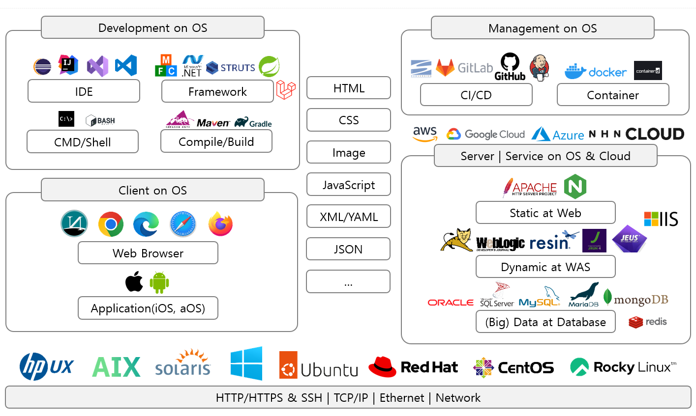

> YOU ARE STRICTLY PROHIBITED TO COPY, DISCLOSE, DISTRIBUTE, MODIFY OR USE THIS
DOCUMENT IN PART OR AS A WHOLE WITHOUT THE PRIOR WRITTEN CONSENT OF
PLUTOZONE.COM.
PLUTOZONE.COM OWNS THE INTELLECTUAL PROPERTY RIGHTS IN AND TO THIS DOCUMENT.
COPYRIGHT © 2005 PLUTOZONE.COM ALL RIGHTS RESERVED
***
> 하기 문서에 대한 저작권을 포함한 지적재산권은 plutozone.com에 있으며 plutozone.com이 명시적으
로 허용하지 않는 사용, 복사, 변경 및 제 3자에 의한 공개, 배포는 엄격히 금지되며
plutozone.com의 지적재산권 침해에 해당된다.
***
> Copyright © 2005 plutozone.com All Rights Reserved




# Overview
- Our knowledge and wisdom are learned from someone and should be given to the next person.
- This article introduces some technical aspects of information technology and was written based on the author's subjective opinion. Therefore the author is not legally responsible for any problems that may arise during citation or application and the information may be changed without notice.
- `Markdown + Example or Demo Source + Image + PDF for IT(Information Technology)`
- `Open Source exists in a other Repository`


# History
- 2025-04-21 [REPORT] Renewal end!
- 2024-10-16 [REPORT] Renewal begins!
- 2024-04-30 [UPDATE] Repository Name(The previous repository name was com.plutozone.education)
- 2023-09-29 [UPDATE] Repository Name(The previous repository name was com.plutozone.programming.java)
- 2023-09-28 [INSERT] messenger Package
- 2023-08-31 [INSERT] AutoReservation.java
- 2023-08-23 [CREATE] Initial Release


# Reference
- 2023-08-24 [INSERT] Comment in only 개선(BETTER), 추가(INSERT), 결함(FAULT), 수정(UPDATE), 삭제(DELETE), 참고(REPORT) for Push
- 2023-08-24 [REPORT] Generate a token for an Eclipse Password(Profile > Settings > Developer Settings > Personal access tokens (classic) at GitHub)


# Temporary
- 요구사항 정의서와 명세서 그리고 차이점
- Nexus Repository for Maven(Java), NPM(Node.js), PyPI(Python), ATP/YUM, Raw 등 설치 및 설정 그리고 관리
- ELK Stack(Elastic search + Logstash + Kibana and Beats)
	- Overview
		- Elastic Search(=Storage)
		- Logstash(=Data Processing)
		- Kibana(Visualize)
		- Beats(Data Collection)
	- Configuration	
		- *.log > Filebeat(수집) > Logstash(처리) > Elastic Search(저장) > Kibana(전시)
	- Beats	
		- Filebeat(Log File)
		- Metricbeat(CPU, Memory, Disk)
		- Packetbear(Network Traffic)
		- Auditbear(Security Event)
		- Heartbear(Service Health Check)
- GitHub + AWS CodePipeline + AWS CodeBuild + AWS Elastic Beantalk(무료: 서비스에 대한 배포, 운영, 확장을 지원하는 PaaS)
- Citrix
	- Citrix Hypervisor(=XenServer): Citrix의 가상화 Hypervisor
	- Citrix Xencenter: Xenserver에 연결하여 VM, Storage 등의 Resource를 관리하는 도구
	- Citrix Virtual Desktop and Apps: Citrix의 가상 데스크톱 또는 가상 앱
- ISMS-P and https://edu.privacy.go.kr/
- cmd.exe
```cmd
C:\>netstat -ano | find "80"		# "80" 확인 vs. "LISTEN" 등
```
- Builder(Ant, Maven, Gradle 등) + CI(GitLab, GitHub 등) + CD(Jenkins 등) + WAS(Tomcat 등)
	- Common
		- Eclipse Maven Project(Spring Web at mavenForMoon.zip)
			- 디렉토리 구조를 Maven 형태로 변경하고 Source(*.java), Output(*.class) 등을 설정(참조 Library는 추후 설정)
			- Java 또는 Dynamic Web Project를 Maven Project로 변경
			- pom.xml 설정(dependacy 등 포함)
			- GitLab에 Maven-Wrapper 및 Project 업로드
	- Git Client + Shell을 통한 Build and Deploy
		- Install Git and Clone Repository
		- Build & Deploy by run.sh
	- Jenkins을 통한 Build(mvnw.sh 및 pom.xml을 통해 *.war 생성 등) and Deploy
		- Jenkins(Build Server)에서 GitLab의 Project 다운로드 후 빌드
		- Jenkins(Deploy Server)를 통하여 Tomat(Application Server)에 배포
- Slack
	- Slack + GitLab
		- Slack
			- Add Channel for **GitLab** Repository
			- Add Apps
			- Add "Incoming WebHooks"
			- Select Channel and Copy Webhook URL(예: https://hooks.slack.com/services/...) for GitLab
		- GitLab
			- Go settins > Integrations > Slack notificatios and Paste Webook URL(예: https://hooks.slack.com/services/...)
	- Slack + GitHub
		- Slack
			- Add a Channel for **GitHub** Repository
			- Add Apps at Slack
			- Add "GitHub"
			- Select a Channel and Write command(/github subscribe [Owner/Repository] or /github unsubscribe [Owner/Repository])
- Open Source
	- copyright(Apache 2.0) vs. copyleft(GPL 3.0)
	- Copyright
		- 콘텐츠는 저작권 표시가 없어도 원칙적으로 저작권 보호를 받는다. 단, 구글 검색 등은 제외될 수도 있다.
		- 침해의 기준은 복사가 아닌 손해가 실제 발생한 경우에 적용될 수도 있다.
		- 소스 저작권 vs. 오픈 소스 저작권
	- 지식(지적) 재산권의 분류와 관할 기관 및 기한 in Korea


# Markdown
- 
- 
- 
