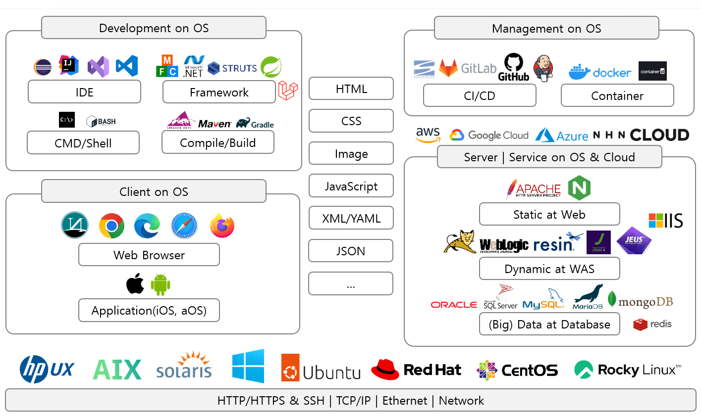

<!--
- 
- 
- 
-->
> YOU ARE STRICTLY PROHIBITED TO COPY, DISCLOSE, DISTRIBUTE, MODIFY OR USE THIS
DOCUMENT IN PART OR AS A WHOLE WITHOUT THE PRIOR WRITTEN CONSENT OF
PLUTOZONE.COM.
PLUTOZONE.COM OWNS THE INTELLECTUAL PROPERTY RIGHTS IN AND TO THIS DOCUMENT.
COPYRIGHT © 2005 PLUTOZONE.COM ALL RIGHTS RESERVED
***
> 하기 문서에 대한 저작권을 포함한 지적재산권은 plutozone.com에 있으며 plutozone.com이 명시적으
로 허용하지 않는 사용, 복사, 변경 및 제 3자에 의한 공개, 배포는 엄격히 금지되며
plutozone.com의 지적재산권 침해에 해당된다.
***
> Copyright © 2005 plutozone.com All Rights Reserved

# Overview
- Our knowledge and wisdom are learned from someone and should be given to the next person.
- This article introduces some technical aspects of information technology and was written based on the author's subjective opinion. Therefore the author is not legally responsible for any problems that may arise during citation or application and the information may be changed without notice.
- `Markdown + Example or Demo Source + Image + PDF for IT(Information Technology)`
- `Open Source exists in a other Repository`

# History
- 2025-04-21 [REPORT] Renewal end!
- 2024-10-16 [REPORT] Renewal begins!
- 2024-04-30 [UPDATE] Repository Name(The previous repository name was com.plutozone.education)
- 2023-09-29 [UPDATE] Repository Name(The previous repository name was com.plutozone.programming.java)
- 2023-09-28 [INSERT] messenger Package
- 2023-08-31 [INSERT] AutoReservation.java
- 2023-08-23 [CREATE] Initial Release

# Reference
- Comment in only ..., 개선(BETTER), 추가(INSERT), 결함(FAULT), 수정(UPDATE), 삭제(DELETE), 참고(REPORT) for Push
- Generate a token for an Eclipse Password(Profile > Settings > Developer Settings > Personal access tokens (classic) at GitHub)