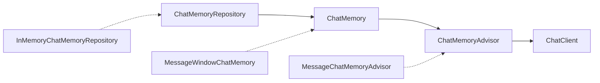
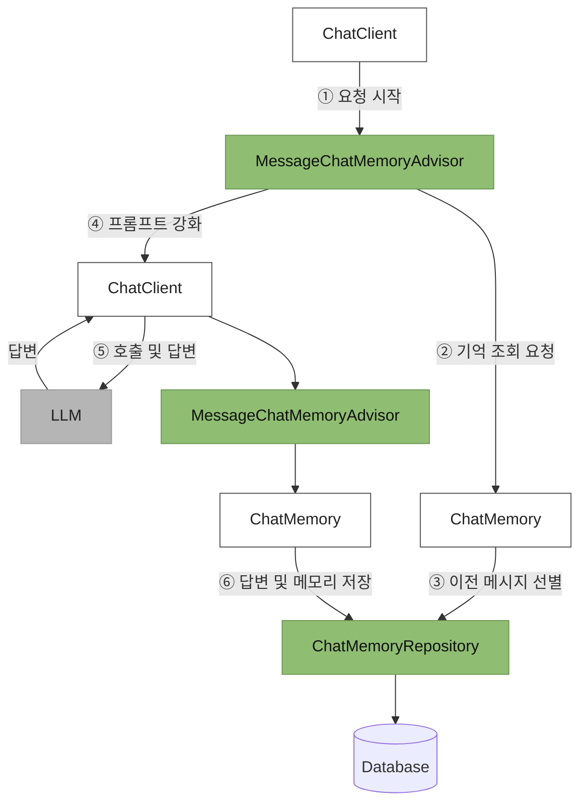

# com.plutozone.knowledge.ai.RAG

## 1. Overview

### RAG(Retrieval Augmented Generation, 검색 증강 생성)란?

> 생성형 AI가 답변을 만들기 전에 관련 정보를 먼저 검색(Retrieval)한 뒤 그 정보를 바탕으로 답변을 생성(Generation)하는 방식

### 필요성

일반적인 대규모 언어 모델(LLM)은 학습된 데이터에 기반해 답변합니다. 그래서 다음과 같은 한계가 있다.

- 최신 정보를 모를 수 있음
- 회사 내부 문서처럼 학습되지 않은 정보를 알 수 없음
- 사실과 다른 내용을 그럴듯하게 만들어내는 현상(환각, Hallucination)이 발생할 수 있음

RAG는 이러한 문제를 줄이기 위해 사용됩니다.

### 프로세스

1. 사용자가 질문
	- "우리 회사의 재택근무 규정은?"
2. 관련 문서 검색(Retrieval)
	- 문서 데이터베이스에서 관련 규정 문서를 찾습니다.
	- 일반적으로 벡터 데이터베이스를 사용하여 `의미 기반 검색`을 수행합니다.
3. 검색 결과를 LLM에 전달
	- 질문 + 검색된 문서를 함께 프롬프트에 포함합니다.
4. 답변 생성(Generation)
	- LLM이 검색된 내용을 근거로 답변을 생성합니다.

### 예시

- 회사 매뉴얼에 다음과 같은 내용이 있다고 가정해 보겠습니다.
	- "직원은 주 2회까지 재택근무가 가능합니다."
- 사용자가
	- "재택근무는 몇 번까지 가능해?"라고 질문하면 ...
- `일반 LLM은 추측해서 답할 수`도 있습니다. 그러나 `RAG는 회사 매뉴얼을 검색한 후 "주 2회까지 가능합니다."라고 근거 있는 답변`을 제공합니다.

### 주요 구성 요소

- 문서 저장소(PDF, Word, Wiki, Notion, 데이터베이스 등)
- 임베딩(Embedding, 문서를 벡터로 변환)
- 벡터 데이터베이스(`의미 기반 검색` 수행)
- Retriever(관련 문서를 찾아오는 역할)
- LLM(검색된 정보를 바탕으로 답변 생성)

### 특징

- 최신 문서를 반영할 수 있음
- 사내 문서 등 자체 데이터 활용 가능
- 환각을 줄이고 답변의 정확도를 높일 수 있음
- 모델을 다시 학습시키지 않아도 문서만 업데이트하면 최신 정보 반영 가능

### 주의점

- 검색(=`의미 기반 검색`) 품질이 낮으면 답변 품질도 떨어짐
- 검색과 생성 단계를 거쳐 응답 속도가 다소 느려질 수 있음
- 벡터 데이터베이스와 임베딩 관리 등 추가적인 인프라가 필요함

### RAG는 언제 사용하는가?

RAG는 다음과 같은 서비스에서 많이 사용됩니다.

- 사내 문서 기반 AI 챗봇
- 고객 지원(Q&A) 챗봇
- 법률·의료 문서 검색
- 제품 매뉴얼 검색
- 논문 및 기술 문서 질의응답
- 기업 지식관리(Knowledge Base)

### RAG와 파인튜닝(Fine-tuning)의 차이

| 구분 | RAG | 파인튜닝 |
| :---: | --- | -------- |
| 목적 | 외부 지식 활용  | 모델의 행동·스타일·특정 작업 능력 개선 |
| 데이터 변경 | 문서만 업데이트 | 모델 재학습 필요 |
| 최신 정보 | 쉬움 | 어려움 |
| 비용 | 비교적 낮음 | 상대적으로 높음 |
| 활용 | FAQ, 문서 검색, 사내 챗봇 | 전문 용어 사용, 특정 형식의 답변, 분류·추론 성능 개선 |

`실무에서는 둘을 함께 사용`하는 경우도 많습니다. 예를 들어 파인튜닝으로 특정 업무 스타일이나 응답 형식을 익히게 하고 RAG로 최신 사내 문서나 정책을 검색해 근거 있는 답변을 생성하는 방식입니다. 이는 모델의 표현 능력과 최신 정보 활용을 동시에 확보할 수 있는 접근입니다.

## 2. Spring AI

### 2-1. ChatMemory

> ChatClient에 메모리 기능 관련 객체를 주입하는 구조

- ChatMemoryRepository(저장소): 가장 먼저 모든 기억의 기초가 되는 데이터 저장소가 빈으로 등록되며 모든 대화 기록이 물리적으로 머무는 곳
- ChatMemory(전략): 등록된 저장소를 주입받아 "최근 몇 개의 메시지를 기억할 것인가?"와 같은 대화 관리 정책을 수행하는 MessageWindowChatMemory가 구성
- ChatMemoryAdvisor(Advisor): 앞서 설정된 메모리 전략을 바탕으로 실제 대화 도중 적절한 시점에 과거 맥락을 꺼내어 프롬프트를 강화하는 역할을 담당
- ChatClient(최종 객체): 마지막으로 ChatCient가 ChatMlemoryAdvisor를 자신의 기본 설정으로 주입 받음으로써 대화 맥락을 완벽하게 이해할 준비 완료

> 메모리 기능 동작 프로세스

### 3-1. 내장 Advisor

#### 3-1-1. 로깅 Advisor(SimpleLoggerAdvisor)

: ChatClient의 요청과 응답 내용을 로깅하며 LLM 상호작용을 디버깅하고 모니터링을 할 때 유용

#### 3-1-2. 사용자 질문 검사 Advisor(SafeGuardAdvisor)

: 사용자 질문에서 민감한 단어가 포함되어 있을 경우 요청을 처리하지 않고 차단

#### 3-1-3. 대화 기억(Chat Memory) Advisor

##### MessageChatMemoryAdvisor

: 대화 기억을 메시지 모음으로 프롬프트에 추가(대화 내용을 사용자와 어시스턴트라는 역할로 구분해 프롬프트에 추가하며 GPT-5와 같은 최신 LLM은 역할 구분을 기반으로 문맥을 이해할 수 있어 일반적으로 가장 권장되 는 방식)

##### PromptChatMemoryAdvisor

: 대화 기억을 프롬프트의 시스템 텍스트에 추가(역할 구분 없이 과거 대화 전체를 하나의 긴 텍스트 뭉치로 변환하여 프롬 프트 템플릿의 특정 위치에 삽입하며 메시지 역할을 지원하지 않는 구형 LLM을 사용하거나 개발자가 대화 형식을 개인화할 때 적절한 Advisor)

##### VectorStoreChatMemoryAdvisor

: 대화 기억을 벡터 저장소에서 검색하여 프롬프트의 시스템 텍스트에 추가(벡터 데이터베이스를 활용해 현재 질문과 관련된 과거 기록만 선별해 가져오며 대화량이 많아져도 필요한 맥락을 효과적으로 활용 가능)

#### 3-1-4. 검색 증강 생성(RAG) Advisor

##### QuestionAnswerAdvisor

: 사용자의 질문과 관련된 내용을 벡터 저장소에서 조회하고 결과를 사용자 메시지에 추가

##### RetrievalAugmentationAdvisor

: 모듈식 아키텍처 기반 Advisor로 런타임 시 다양한 모듈을 결합하여 프롬프트를 강화(하기는 사용 시점에 따른 종류)

- 검색 전(Pre-Retrieval) 모듈: 유사도 검색 전에 실행되는 모듈
	- `압축 쿼리 변환기(Compression Query Transformer)`: 대화 기억과 관련이 있는 모호한 사용자의 질문을 LLM을 이용해서 완전한 질문으로 변환(예: 국회 의원은? > 국회 의원의 임기는 몇 년입니까?)
	- `쿼리 재작성 변환기(Rewrite Query Transformer)`: 사용자 질문에 검색 결과의 품질에 영향을 줄 수 있는 불필요한 내용이 포함되어 있을 경우 LLM을 이용해서 사용자의 질문을 재작성(예: 국회 의원은 하는 일도 없이 당파 싸움만 .... > 국회 의원의 임무와 역할에 대해 알려 주세요.)
	- `번역 쿼리 변환기(Translation Query Transformer)`: 사용자 질문을 LLM을 이용해서 임베딩 모델이 지원하는 대상 언어로 번역합니다. 사용자 질문이 이미 대상 언어로 되어 있거나 언어를 알 수 없 는 경우에는 번역하지 않음(=언어 변환)
	- `쿼리 확장(MultiQuery Expander)`: 사용자의 질문을 LLM을 이용해서 다양한 변형 질문으로 확장합니다. 확장된 질문들은 개별적으로 벡터 저장소 유사도 검색에 사용되며 검색된 Document들은 자동으로 합쳐짐(예: 대통령의 임기는 어떻게 됩니까? > 대통령의 임기 규정은 무엇인가요? 대통령의 임기 기간은 얼마인가요? 한국 대통령의 임기 제도에 대한 정보는?)
- 검색(Retrieval) 모듈: 유사도 검색 시 사용하는 모듈
- 검색 후(Post-Retrieval) 모듈: 유사도 검색 후에 실행되는 모듈
- 생성(Generation) 모듈: LLM에 보내기 직전에 실행되는 모듈

| RAG 단계 | 모듈 종류 | 주요 인터페이스 / 클래스 | 역할 | 대표 구현 |
|---|---|---|---|---|
| **Pre-Retrieval** | Query Transformation | `QueryTransformer` | 검색 전에 사용자 질의를 더 검색하기 좋은 형태로 변환 | `RewriteQueryTransformer`, `CompressionQueryTransformer`, `TranslationQueryTransformer` |
| **Pre-Retrieval** | Query Expansion | `QueryExpander` | 하나의 질의를 여러 개의 다양한 질의로 확장 | `MultiQueryExpander` |
| **Retrieval** | Document Retrieval | `DocumentRetriever` | 변환·확장된 질의를 기반으로 관련 Document 검색 | `VectorStoreDocumentRetriever` |
| **Retrieval** | Query Routing | `QueryRouter` | 여러 Retriever 또는 데이터 소스로 질의를 라우팅 | `AllRetrieversQueryRouter` 등 |
| **Retrieval** | Document Join | `DocumentJoiner` | 여러 Query/Retriever에서 검색된 Document를 하나로 결합 | `ConcatenationDocumentJoiner` |
| **Post-Retrieval** | Document Post-Processing | `DocumentPostProcessor` | 검색된 Document를 재정렬, 필터링, 압축 등으로 후처리 | 커스텀 구현 가능 |
| **Generation** | Query Augmentation | `QueryAugmenter` | 검색된 Document의 내용을 사용자 질의에 추가하여 LLM 입력으로 구성 | `ContextualQueryAugmenter` |

### 3-2. TokenTextSplitter

#### Parameter(매개변수)

- int chunkSize: 임시 청크로 나눌 때 기준이 되는 토큰 수(기본값: 800)
- int minChunkSizeChars: 확정 청크의 최소 문자 수(기본값: 350)
- int minChunkLengthToEmbed: 자투리 텍스트가 확정 청크가 되기 위한 최소 문자 수이며 너무 짧은 텍스트는 임베딩 효율을 떨어뜨리므로 제외(기본값: 5)
- int maxNumChunks: 확정 청크 최대 수이며 확정 청크 수가 이 수를 초과하면 나머지는 무시되는데 임베딩 비용을 줄이기 위함(기본값: 10000)
- boolean keepSeparator: 줄바꿈(\n)를 청크에 포함할 지 여부이며 문장 경계를 명확히 할 때 유리할 수 있음(기본값: true)
- Token TextSplitter는 이들 매개변수를 런타임 시 다음 순서로 사용합니다.

#### 적용

- 입력 텍스트를 CL1OOK BASE 인코딩을 사용하여 토큰으로 변환
- chunkSize를 기준으로 임시 청크로 분할(예: 2,000 토큰 = 800, 800, 400으로 임시 청크로 분할)
- 각 임시 청크에 대해 아래 내용을 반복
	- 다시 텍스트로 디코딩
	- 텍스트를 minChunksizeChars 기준으로 분리하되 자연스러운 분리가 되도록 minChunkSizeChars 이후에 나오는 마침표, 물음표, 느낌표, 줄바꿈에서 분리
	- 분리된 텍스트의 앞뒤 공백을 제거하고 keepSeparator 설정에 따라 줄바꿈 문자를 제거
<!--
알아 두면 좋아요 TokenTextSplitter의 동작 이해하기
방금 살펴본 파라미터들이 실제 텍스트 분할 과정에서 어떻게 적용되는지 제빵사의 작업 방식에 빗대 어 이해해 봅시다. 제빵사 앞에는 아주 긴 바게트 빵 한 개가 놓여 있습니다. 제빵사는 앞에서 설정한 파라미터 기준에 맞춰 빵을 자릅니다.
1. 자르기 준비: 제빵사는 "이 긴 빵 하나에서 최대 5000조각까지만 잘라낼 거야. 그리고 잘라낸 조각 이 10g도 안 되는 부스러기라면 손님에게 낼 수 없으니 과감하게 버리겠어."라는 목표를 설정합니다.
2. 최소량 확보: 제빵사는 빵을 자르기 시작할 때, 일단 최소 200g의 크기가 될 때까지는 칼을 대지 않 고 무조건 길이를 확보합니다. 한 입 거리도 안 되는 너무 작은 조각이 나오는 것을 막기 위함입니다.
3. 지점 탐색: 200g을 넘어서는 순간부터 제빵사는 눈을 크게 뜨고 빵 표면에 자연스럽게 나 있는 '결' 이나 '칼집' (마침표나 줄 바꿈)을 찾기 시작합니다. 이때 잘린 단면의 모양(줄 바꿈 등)을 뭉개지 않고 원래 결을 그대로 살려서 자를 준비를 합니다.
4. 유연한 절단: 목표치인 800g에 도달하기 전에 예쁜 결(마침표)을 발견하면, 미련 없이 그곳을 자릅 니다. 조각이 800g을 꽉 채우지 못하더라도, 손님이 먹기 좋게(문장의 의미가 끊기지 않게) 만드는 것 이 더 중요하기 때문입니다.
5. 강제 절단: 만약 빵이 너무 밋밋해서 썰기 좋은 결을 찾지 못한 채 목표치인 800g에 도달해버렸다면 제빵사는 빵이 더 이상 커지는 것을 막기 위해 800g이 되는 지점에서 칼로 싹둑 강제로 자릅니다.
6. 다음 작업: 성공적으로 잘라낸 빵 조각을 바구니에 담고, 남은 빵을 가져와 다시 2번부터 똑같은 과 정을 반복하며 끝까지 소분합니다.
이처럼 TokenTextSplitter는 단순한 기계적 분할이 아니라, 문맥의 끊김을 최소화하는 똑똑한 분할 전 략을 사용합니다.
-->	