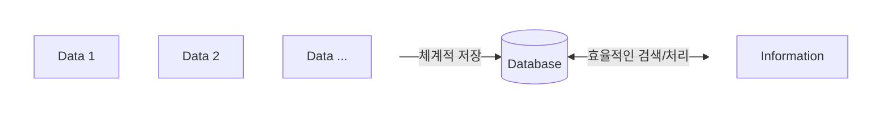
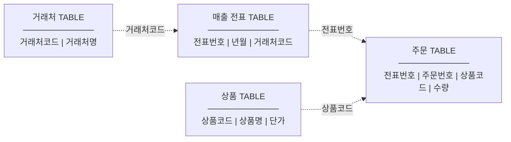
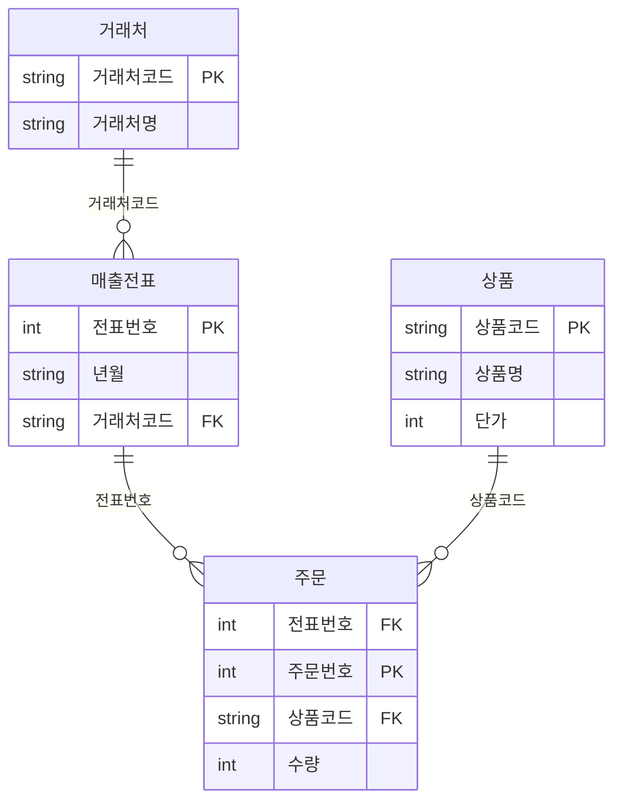
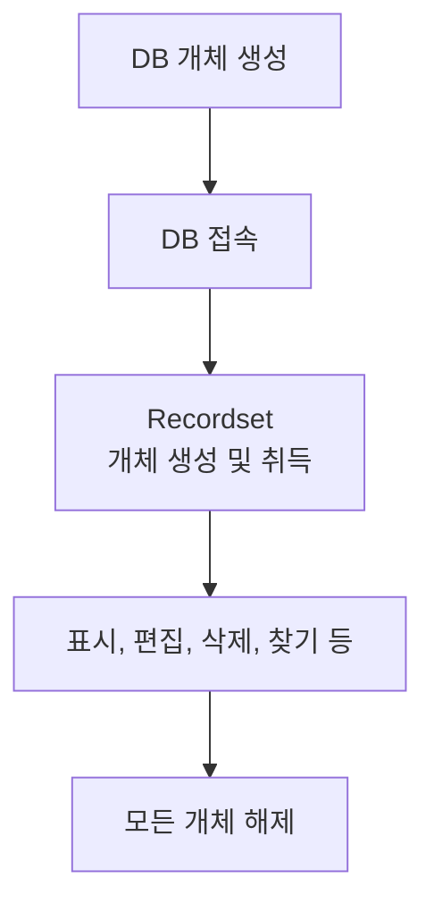
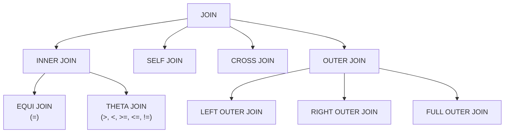

# com.plutozone.knowledge.database

<!--
## TODO
- 기존 문서들 추가
- NCS 20 페이지부터 재시작
-->

## Contents
01. [개요](#1-개요)
02. [설계](#2-설계)
03. [데이터 정규화](#3-데이터-정규화)
04. [SQL(Structure Query Language) 기본](#4-sqlstructure-query-language-기본)
05. [SQL(Structure Query Language) 확장](#5-sqlstructure-query-language-고급)
06. [데이터 조작 및 관리](#6-데이터-조작-및-관리)
07. [객체](#7-객체)
08. [성능(Performance)](#8-성능performance)
09. [데이터 무결성과 보안](#9-데이터-무결성과-보안)
10. [운영](#10-운영)
11. [주요 Query](#11-주요-query)
12. [주요 Command](#12-주요-command)
13. [프로젝트](#13-프로젝트)


## 1. 개요
> Data and Information vs. DB(DataBase) vs. DBMS(DataBase Management System) vs. RDBMS(Relational DataBase Management System)

> Database for Programmer vs. DBA(Database Administrator) 

### 1-1. 데이터(Data)와 정보(Information)


### 1-2. DB(DataBase)란?
데이터베이스는 체계(구조와 형식)적으로 저장된 자료(Data)의 집합체이며 이들 자료(Data)들은 효율적인 검색/처리가 가능하다. 그러므로 체계적으로 저장되지 못한 자료(Data)는 데이터베이스라고 할 수 없으며 정보(Information)로써의 가치가 전혀 없다. 정보의 정확성과 신속성이 요구되는 현대 사회에서 자료를 체계적으로 관리/이용하기 위한 데이터베이스의 중요성은 더해 가고 있다.

예: 단순 형식으로 저장된 자료의 집합체: *.csv(Comma Separated Value)

- Database의 이점
	- Data의 중복 통제와 일관성 유지
	- Data 취득 용이와 응답 시간의 단축
	- 표준화의 용이성
	- Programmer의 생산성 향상
	- 일관성 있는 Data 관리


### 1-3. DBMS(DataBase Management System)
DBMS(데이터베이스 관리 시스템)는 Database의 구성, Access 방법, 관리 유지에 대한 모든 Role을 지고 있는 Software System

- 개요
- 특징(무결성, 독립성, 보안, 중복 최소화, 안정성 등)
- 구조/형식에 따른 분류(관계형, 객체 지향형, 계층형, 네트워크형, 망형 등)

### 1-4. 관계형 데이터베이스(RDBMS, Relational DataBase Management System)
관계형 데이터베이스는 ...
또한 데이터베이스에 포함되는 이러한 테이블이 서로 어떤 관련이 있는가를 Relationship이라고 한다. 또한 RDB(*.csv, *.xls, *.mdb, RDBMS) 계열은 상호 변환이 용이하다.




- DBF, Clipper, Foxplus
- Oracle
	- 역사
	- 에디션(Personal, Standard One, Standard, Enterprise 그리고 [Express](./oracle.md))
	- 설치 등
	- Client Tool
		- SQL Developer
			- GUI 기반 Client Tool at Oracle
			- Data Modeler 등
		- SQL*Plus
			- Text 기반 Client Tool at Oracle
		- Oracle Application Express
			-  Web 기반 Client Tool at Oracle
- Microsoft Access, Microsoft SQL Server
- MySQL
- MariaDB
- PostgreSQL
- IBM DB2
- ...

### 1-5. 데이터베이스 관련 업무 at 프로젝트
#### 정보 시스템 구축 그리고 모델링
- 구축 절차(요구사항 분석, 설계, 구현, 검증 그리고 유지보수)
- 데이터 모델링과 용어(데이터와 데이터베이스, 테이블과 스키마, DMBS, 열, 데이터 유형, 기본키와 외래키, SQL 등)

#### DB 설치 및 구축
- 스키마(Table Space, User 등) 생성
- Table 생성 및 데이터 입력, 조회 등

#### DB 성능과 모니터링
- Index(속도 등), View(가상과 보안 등), Stored Procedure(프로그래밍 등), Trigger(주의)
- Execution Plan

#### 백업과 복원
- exp.exe 그리고 imp.exe at Oracle

#### 응용 프로그램과 연동
데이터베이스 프로그래밍이란 데이터베이스에 접속하여 레코드 셋을 취득하거나 레코드의 추가/갱신/삭제 작업을 하는 프로그래밍이다.
- Java(Spring), .NET, PHP(Laravel) 등



## 2. 설계
### 2-1. 데이터 모델링
#### 소프트웨어 개발 방법론
- Waterfall(폭포수), 애자일(Agile) 등

#### 데이터 모델링이란?
- 데이터 모델링은 프로젝트 목표를 데이터베이스 개체로 표현한 것
- 데이터 모델링은 일반적으로 프로젝트 경험이 많고 관련 지식이 많은 PM이 담당
- 데이터 모델링은 개념적, 논리적 그리고 물리적 모델링 단계를 거친다.
- 데이터 모델링과 정규화, 관계, 기본키, 외래키, 컬럼, 데이터 형식, 필수 여부 등

#### 데이터 모델링 툴(Tool)
- Data Modeler at Oracle SQL Developer
- ER Modeler at MySQL Workbench
- ERwin, exERD 등

#### 데이터 모델링 절차
- 업무 분석
- 개념적 DB 모델링 with ER Diagram
	- Entity
	- Attribute
	- Identity
	- Relation
	- Dimension
- 논리적 DB 모델링 with Case Tool
	- ER Diagram
	- Mapping Rule
	- Normalization
	- Data Type and Size
- 물리적 DB 모델링 with Case Tool
	- DBMS
	- Data Type and Size
	- 데이터 사용 및 업무 프로세스 분석
	- Denormalization
	- Index
	- Constraint
	- Stored Procedure, Function, View, Trigger, ...
	- Create DB

### 2-2. ERD(Entity Relationship Diagram)
### 2-3. 엔터티(Entity)와 속성(Attribute)
### 2-4. 관계(Relationship)
- 3가지 형태의 Relationship(관계)
	- 一 對 多: 한 쪽 테이블의 레코드 하나가 또 다른 쪽 테이블의 여러 레코드와 대응하는 릴레이션십으로 데이터를 효율적으로 축적/추출할 수 있어 가장 많이 사용된다.
	- 一 對 一: 구조는 간단하나 근본적으로 하나의 테이블과 같다.
	- 多 對 多: 구조가 복합하며 두 테이블 사이에 새로운 테이블을 설계하는 것에 의해 두 개의 一對多 또는 多對一의 릴레이션십으로 교체할 수 있다.

### 2-5. 기본키(Primary Key)와 외래키(Foreign Key)
기본 키와 외부 키는 릴레이션십을 작성할 때 사용하는 필드이다. 기본키는 등록한 데이터를 식별하기 위해 사용되므로 반드시 입력되어야 하며 자동 인덱스되며 중복될 수 없다. 외부키는 다른 테이블의 기본키와 일치하는 값을 갖고 있으며 반드시 입력되어야 한다. 기본키와 외부키를 설정할 때 필드명은 동일할 필요는 없으나 데이터형은 동일하게 할 필요가 있다.
- Primary Key: 매출 전표 TABLE의 전표번호 필드, 상품 TABLE의 상품코드 필드
- Foreign Key: 주문 TABLE의 전표번호 필드 등

### 2-6. 데이터 타입(Data Type)
- 명시적 변환(Explicit Conversion) vs. 암시적 변환(Implicit Conversion)

#### ANSI
| Oracle     | ANSI     | 범위(크기)      | Range |
|------------|----------|----------------|-------|
| NUMBER(3)  | tinyint  | 2^8  (1 바이트) | -2^7(-128) ~ 2^7-1(127) 또는 0 ~ 255 |
| NUMBER(5)  | smallint | 2^16 (2 바이트) | -2^15(-32,768) ~ 2^15-1(32,767) 또는 0 ~ 65,535 |
| NUMBER(10) | int      | 2^32 (4 바이트) | -2^31(-2,147,483,648) ~ 2^31-1(2,147,483,647) 또는 0 ~ 4,294,967,295 |
| NUMBER(19) | bigint   | 2^64 (8 바이트) | -2^63 ~ 2^63-1 |

#### Oracle
- NUMBER
- CHAR, VARCHAR2, NCHAR, NVARCHAR2, CLOB, NCLOB
- BLOB
- DATE

## 3. 데이터 정규화
정규화는 테이블의 정규화라고 볼 수 있으며 이는 데이터를 보호하고 정규화 규칙을 사용하여 테이블 사이의 관계를 정립하는 것이다. 논리적 DB 디자인을 정규화하는 것은 형식적인 방법을 사용하여 데이터를 여러 개의 관련된 테이블(1:多 또는 多:1)로 저장하는 것이다.

### 3-1. 정규화의 필요성
- 장점(성능 향상)
	- 보다 빠른 정렬과 인덱스 작성 가능- SELECT문 향상
	- INSERT, UPDATE, DELETE문 향상
	- NULL 값이 줄어들고, 불일치 가능성(참조 정합성) 감소
- 단점
	- 정규화가 많이 될수록 데이터를 검색하는데 필요한 JOIN의 복잡화로 인해 성능 문제 발생

### 3-2. 정규화 규칙
#### 테이블 식별자 지정(=PK)
테이블의 다른 모든 Row 데이터로부터 하나의 Row 데이터만 구별할 수 있는 컬럼이 있어야 한다.

#### 테이블에는 한 유형의 Entity만 존재
테이블에 너무 많은 정보를 저장하면 데이터를 효율적으로 관리하기 어렵다.

#### 테이블 컬럼에 Null값 허용 자제
Null값을 허용하는 것이 유용할 때도 있지만 복잡한 데이터 작업을 요하는 특수 처리가 필요하므로 가급적 사용을 피하는 것이 좋다.

#### 테이블의 반복된 값이나 컬럼 제외
데이터베이스의 테이블에서 특정 정보에 대해 여러 값을 지정하면 안 된다.

### 3-3. 정규화 유형
#### 제1정규형(1NF)
#### 제2정규형(2NF)
#### 제3정규형(3NF)
#### 반정규화


## 4. SQL(Structure Query Language) 기본
> DDL(Data Definition Language) vs. DML(Data Manipulation Language) and DCL(Data Control Language)/TCL(Transaction Control Language)

### 4-1. SQL 개요
- SQL(구조적 질의 언어)이란?
- 특징
- ANSI SQL vs. PL/SQL vs. T-SQL

### 4-2. SQL 분류
#### DDL(Data Definition Language, 데이터 정의 언어) 
- 주요 대상
	- 스키마(Schema, DBMS의 특징과 구축 환경에 기반한 데이터베이스의 구조, 제약 조건, 개체, 속성, 관계 및 데이터 조작에 대한 총칭)
	- 도메인(Domain, 개체 속성의 데이터 타입과 범위, 제약 조건 등을 설정한 정보 예: 주소를 varchar(256)로 정의)
	- 테이블(Table, 데이터 저장 공간)
	- 뷰(View, 1개 이상의 물리 테이블을 통해서 만드는 가상의 논리 테이블)
	- 인덱스(Index, 빠른 검색을 위한 데이터 구조)
	- ...
- 주요 유형
	- 생성(CREATE)
	- 변경(ALTER)
	- 삭제(DROP)
	- 비움(TRUNCATE, 로깅하지 않고 데이터 삭제)
	- ...
- 주요 제약 조건(Constraint)
	- PRIMARY KEY(PK, 테이블의 기본 키를 정의하며 기본적으로 NOT NULL, UNIQUE 제약 사항이 설정됨)
	- FOREIGN KEY(FK, 테이블에 외래 키를 정의하며 참조 대상을 테이블명(칼럼명) 형식으로 작성해야 하며 참조 무결성이 위배되는 상황 발생 시 옵션(CASCADE, NO ACTION, SET NULL, SET DEFAULT)으로 처리 가능)
	- UNIQUE(UI, 테이블에서 해당하는 열값은 유일해야 함을 의미하며 테이블에서 모든 값이 다르게 적재되어야 하는 열에 설정됨)
	- NOT NULL(NN, 테이블에서 해당하는 열의 값은 NULL 불가능하며 필수적으로 입력해야 하는 항목에 설정함)
	- CHECK(CK, 사용자가 직접 정의하는 제약 조건으로 발생 가능한 상황에 따라 여러 가지 조건을 설정 가능)

#### DML(Data Manipulation Language)
- 조회(SELECT), 추가(INSERT), 수정(UPDATE), 삭제(DELETE)
- 다중 테이블 조회(SELECT)
	- 조인(JOIN, 두 개의 테이블을 결합하여 데이터를 추출하는 기법)
	- 서브쿼리(Subquery, SQL문 안에 포함된 SQL문 형태의 사용 기법)
	- 집합(UNION, 연산자 테이블을 집합 개념으로 조작하는 기법)

#### DCL(Data Control Language)/TCL(Transcation Control Language)
- 대상과 오브젝트 유형(목적)
	- 사용자 권한(접근 통제, DBMS에 접근할 사용자를 등록하고 특정 사용자에게 데이터베이스의 사용 권한을 부여하는 작업)
	- 트랜잭션(안전하고 무결한 거래 보장, 동시 다발적으로 발생하는 다수 작업을 독립적이고 안전하게 처리하기 위한 데이터베이스 작업 단위)
- 유형에 따른 명령
	- DCL
		- GRANT: 데이터베이스 사용자 권한 부여
		- REVOKE: 데이터베이스 사용자 권한 회수
	- TCL
		- COMMIT: 트랜잭션 확정
		- ROLLBACK: 트랜잭션 취소
		- CHECKPOINT: 복귀지점 설정
- 권한 유형과 명령
	- 시스템
		- CREATE USER: 계정 생성
		- DROP USER: 계정 삭제
		- DROP ANY TABLE: 테이블 삭제
		- CREATE SESSION: 데이터베이스 접속
		- CREATE TABLE: 테이블 생성
		- CREATE VIEW: 뷰 생성
		- CREATE SEQUENCE: 시퀀스 생성
		- CREATE PROCEDURE: 함수 생성
		- ...
	- 객체
		- ALTER: 변경
		- INSERT: 추가
		- DELETE: 삭제
		- SELECT: 조회
		- UPDATE: 수정
		- EXECUTE PROCEDURE: 실행
		- ...

### 4-3. 조회(SELECT)
- FROM과 owner, column, alias
- CREATE TABLE … AS SELECT

### 4-4. 조건(WHERE)
- WHERE과 operator 그리고 BETWEEN, IN/NOT IN, LIKE, ANY, ALL 및 Sub Query

### 4-5. 정렬(ORDER BY)
- ORDER BY
- ROWNUM, SAMPLE

### 4-6. 그룹(GROUP BY) and 집계(HAVING) and 구분(DISTINCT)
- GROUP BY, HAVING 그리고 Aggregate Function
- DISTINCT

### 4-7. 기타
- ROLLUP(), GROUPING_ID(), CUBE()
- WITH와 CTE


## 5. SQL(Structure Query Language) 고급
### 5-1. JOIN 분류


<details>
	<summary>테이블 정보</summary>

- EMP 테이블 for Employee
	| EID | NAME | DID  | MID  |
	| --- | ---- | ---- | ---- |
	| 1   | Kim  | 1    | NULL |
	| 2   | Lee  | 2    | 1    |
	| 3   | Park | 3    | 1    |
	| 4   | Choi | NULL | 2    |

- DPT 테이블 for Department
	| DID | NAME  |
	| --- | ----- |
	| 1   | Sales |
	| 2   | HR    |
	| 4   | IT    |
</details>

#### 논리적 조인(JOIN)
> 사용자가 작성한 SQL문에 의해서 표현한 테이블 결합 방식
- **내부 조인(`INNER JOIN,` 일치하는 데이터를 기준으로 조회)**
	- 동등 조인(EQUI JOIN): 모두에 존재하는 데이터만 필요한 경우(예: 고객과 주문 정보가 모두 있는 고객의 주문 조회)
		```sql
		SELECT e.EID, e.NAME, d.NAME
		FROM EMP e
		INNER JOIN DPT d
		ON e.DID = d.DID;
		/* = SELECT e.EID, e.NAME, d.NAME FROM EMP e, DPT d WHERE e.DID = d.DID; */
		/* , for INNER, (+) for OUTER */
		```
		| EID    | NAME | NAME      |
		| ------ | ---- | --------- |
		| 1      | Kim  | Sales     |
		| 2      | Lee  | HR        |
		- DID가 같은 행(ON e.DID = d.DID)만 조회됨
		- Park(30)는 Department에 없으므로 제외 + Choi(NULL)도 제외
		```mermaid
		flowchart LR
		subgraph A[Table A]
		A1(( ))
		end

		subgraph B[Table B]
		B1(( ))
		end

		I((A ∩ B))

		A1 --- I
		I --- B1

		style I fill:#66cc66,color:#000
		```
	- 자연 조인(NATURAL JOIN): 이름이 같은 컬럼을 자동으로 찾아 조인(주의: 의도하지 않은 결과가 발생할 수 있어 실무에서는 미권장)
		```sql
		SELECT *
		FROM EMP
		NATURAL JOIN DPT;
		/* = SELECT * FROM EMP e JOIN DPT d ON e.DID = d.DID; */
		```
- **자체 조인(SELF JOIN): 자신이 자신과 조인하며 1개의 테이블을 사용(예: 조직도/직원-관리자, 댓글, 카테고리 등 계층 구조)**
	```sql
	SELECT
		e.name AS employee,
		m.name AS manager
	FROM EMP e
	JOIN EMP m
	-- LEFT JOIN EMP m
		ON e.MID = m.EID;
	```
	```mermaid
	flowchart LR
	T1[Employee AS e1]
	T2[Employee AS e2]

	T1 -->|manager_id = id| T2
	```
- **교차 조인(CROSS JOIN): 조인 조건이 없는 모든 데이터의 조합을 추출**
	```sql
	SELECT *
	FROM EMP e 
	CROSS JOIN DPT d ;
	/* = SELECT * FROM EMP, DPT; */
	```
	```mermaid
	flowchart TD
		A[Table A<br/>3 rows]
		B[Table B<br/>4 rows]

		C["Result<br/>3 × 4 = 12 rows"]

		A --> C
		B --> C
	```	
- **외부 조인(`OUTER JOIN`, 일치하지 않는 데이터도 포함하여 조회)**
	- 왼쪽 외부 조인(`LEFT OUTER JOIN`=LEFT JOIN): 왼쪽 테이블의 모든 데이터를 유지하면서 관련 정보가 있으면 함께 조회하는 경우(예: 모든 부서에 따른 직원 정보 조회)
		```sql
		SELECT e.EID, e.NAME, d.NAME
		FROM EMP e
		LEFT OUTER JOIN DPT d
		-- LEFT JOIN DPT d
		ON e.DID = d.DID;
		```
		| EID | NAME | NAME |
		| --- | ---- | --------- |
		| 1   | Kim  | Sales     |
		| 2   | Lee  | HR        |
		| 3   | Park | NULL      |
		| 4   | Choi | NULL      |
		- Employee의 모든 데이터가 출력
		- Department가 없으면 NULL이 출력
		```mermaid
		flowchart LR
		A((Table A))
		J((A ∩ B))
		B((Table B))

		A --- J --- B

		style A fill:#66cc66,color:#000
		style J fill:#66cc66,color:#000
		```
	- 오른쪽 외부 조인(`RIGHT OUTER JOIN`=RIGHT JOIN): 오른쪽 테이블을 기준으로 모든 데이터를 조회해야 하는 경우(실무에서는 대부분 LEFT JOIN으로 테이블 순서를 변경하여 확인
		```sql
		SELECT e.EID, e.NAME, d.NAME
		FROM EMP e
		RIGHT OUTER JOIN DPT d
		-- RIGHT JOIN DPT d
		ON e.DIP = d.DID;
		```
		| EID  | NAME | NAME |
		| ---- | ---- | --------- |
		| 1    | Kim  | Sales     |
		| 2    | Lee  | HR        |
		| NULL | NULL | IT        |
		- Department의 모든 데이터가 출력
		- IT 부서는 직원이 없으므로 Employee 컬럼은 NULL
		```mermaid
		flowchart LR
		A((Table A))
		J((A ∩ B))
		B((Table B))

		A --- J --- B

		style J fill:#66cc66,color:#000
		style B fill:#66cc66,color:#000
		```
	- 완전 외부 조인(`FULL OUTER JOIN`): 전체 데이터=두 테이블 간 불일치 데이터까지 모두 확인해야 하는 경우(예: 데이터 정합성 검증, 누락 데이터 확인)
		```sql
		SELECT e.EID, e.NAME, d.NAME
		FROM EMP e
		FULL OUTER JOIN DPT d
		ON e.DIP = d.DID;
		```
		| EID  | NAME | NAME |
		| ---- | ---- | --------- |
		| 1    | Kim  | Sales     |
		| 2    | Lee  | HR        |
		| 3    | Park | NULL      |
		| 4    | Choi | NULL      |
		| NULL | NULL | IT        |
		- Employee의 모든 행 + Department의 모든 행
		- FULL OUTER JOIN 지원 여부 확인(PostgreSQL과 SQL Server는 지원하지만 MySQL은 직접 지원하지 않아 LEFT JOIN과 RIGHT JOIN 결과를 UNION으로 결합하는 방식 등을 사용)
		```mermaid
		flowchart LR
		A((Table A))
		J((A ∩ B))
		B((Table B))

		A --- J --- B

		style A fill:#66cc66,color:#000
		style J fill:#66cc66,color:#000
		style B fill:#66cc66,color:#000
		```
#### 물리적 조인(JOIN)
> 데이터베이스 관리시스템의 옵티마이저 엔진에 의해 발생하는 테이블 결합 방식
- Nested Loop Join
- Merge Join
- Hash Join

### 5-2. 조인(JOIN) 문법
| 구분 | INNER JOIN | 쉼표(,) + WHERE |
|------|------------|-----------------|
| 문법 | ANSI 표준 | 구식 문법 |
| 결과 | 동일 | 동일 |
| 조인 조건 | `ON` 절 | `WHERE` 절 |
| 가독성 | 높음 | 낮음 |
| 유지 보수 | 쉬움 | 어려움 |
| 권장 여부 | 권장 | 기존 코드에서 주로 사용 |
<details>
	<summary>예제</summary>

```sql
SELECT
	e.EID
	, e.NAME
	, d.NAME
FROM
	EMP e INNER JOIN DPT d ON e.DID = d.DID
WHERE
	1 = 1;

SELECT
	e.EID
	, e.NAME
	, d.NAME
FROM
	EMP e
	, DPT d
WHERE
	e.DID = d.DID;
```
</details>

### 5-3. Subquery
- 동작하는 방식에 따른 서브쿼리의 종류
	- 비연관(Un-Correlated) 서브쿼리: 서브쿼리 안에 메인쿼리의 칼럼 정보를 가지고 있지 않은 형태(서브쿼리는 메인쿼리 없이 독자적으로 실행)
	- 연관(Correlated) 서브쿼리: 서브쿼리 안에 메인쿼리의 칼럼 정보를 가지고 있는 형태(메인쿼리의 실행된 결과를 통해서 서브쿼리의 조건이 맞는지 확인)
- 반환되는 데이터 형태에 따른 서브쿼리의 종류
	- Single Row(단일 행) 서브쿼리: 서브쿼리의 결과가 항상 1건 이하인 서브쿼리로 단일 행의 비교 연산자에는 =, <, <=, >, >=, <> 등이 사용
	- Multiple Row(다중 행) 서브쿼리: 서브쿼리 실행 결과가 여러 건인 서브쿼리로 다중 행의 비교 연산자에는 IN, EXISTS, ALL, ANY 등이 사용
	- Multiple Column(다중 칼럼) 서브쿼리: 서브쿼리의 실행 결과가 2개 이상 칼럼으로 반환되는 쿼리로 메인쿼리의 조건절에 다수 칼럼을 비교할 때 서브쿼리와메인쿼리에서 비교하는 칼럼 개수, 위치가 동일해야 함

### 5-4. UNION
- 집합 연산자 유형
	- UNION: 2개 이상 SQL문의 실행 결과에 대한 중복을 제거한 합집합
	- UNION ALL: 2개 이상 SQL문의 실행 결과에 대한 중복을 제거하지 않은 합집합
	- INTERSECTION: 2개 이상 SQL문의 실행 결과에 대한 중복을 제거한 교집합
	- EXCEPT(MINUS): 선행 SQL문의 실행 결과와 후행 SQL문의 실행 결과 사이의 중복을 제거한 차집합(일부 DBMS는 MINUS로 사용)


## 6. 데이터 조작 및 관리
### 6-1. INSERT and UPDATE and DELETE 그리고 MERGE
- SEQUENCE, DUAL, MERGE 등 포함
- DELETE(TR Logging) vs. TRUNCATE(TR Not Logging) vs. DROP(Table delete)

### 6-2. 트랜잭션(Transaction)
### 6-3. COMMIT vs. ROLLBACK


## 7. 객체
### Programming
#### PL/SQL at Oracle
- Oracle에서 제공하는 SQL Programming(Stored Procedure, Function, Trigger에도 적용 가능)
- DECLARE … BEGIN … END
- Control Statement: IF, CASE
- Loop Statement: WHILE LOOP, FOR LOOP, CONTINUE, EXIT, GOTO
- DBMS_LOCK.SLEEP()
- EXCEPTION
- Dynamic SQL

### (Built-in) Function
- 명시적 변환(Explicit Conversion) vs. 암시적 변환(Implicit Conversion)
#### 문자 및 문자열
#### 숫자
#### 수학
#### 날짜 및 시간
#### 변환
- Oracle
	- CAST(), TO_CHAR, TO_NUMBER(), TO_DATE()

#### 분석 및 순위
#### 피벗 함수
####  ...

### Table
- GUI vs. SQL
- Constraint: PK, FK, UNIQUE(NULL allow), CHECK, DEFAULT, NULL 그리고 CK(Composite Key)
- Temporary Table과 DROP, ALTER

### View
- 보안, 쿼리 단순화 등
- 읽기 전용 설정과 Material View at Oracle

### Index
 인덱스를 시스템에서 재구축하는 시간과 Load로 인하여 인덱스의 장점인 고속 검색에 반하여 레코드의 증감이나 데이터의 갱신이 많은 테이블에서는 인덱스의 작성을 신중하게 할 필요가 있다.
 - 장점 vs. 단점 그리고 종류
- PK와 UNIQUE vs. CREATE/ALTER/DROP INDEX
- INDEX의 효과적 사용 방안

### Sequence
### Synonym
### Stored Procedure
- Stored Procedure(In/Out Parameter, EXECUTE) vs. Function(only In Parameter, required Return Value and in SQL)

### Function
- only In Parameter, required Return Value and in SQL

### Trigger
- 종류와 주의 사항 등


## 8. 성능(Performance)
### 최적화를 위한 권장 사항
#### 설계(Design) 시
- 반복률이 높은 Column은 Code Table로 작성한다.
- Table 설계 시
	- Table 생성 전에 정규화 및 각 Column의 데이터 유형을 계획하라.
	- 블록 영역을 위해 INITIAL, NEXT, EXTENTS, PCTFREE, PCTUSED를 충분히 고려하라.
	- 지정된 Table Space를 반드시 지정하라(사용자 데이터, 롤백 데이터, 분류 데이터 등).
	- 필요한 경우 No Logging 키워드를 사용하라.
	- 필요한 경우 Cache 키워드를 사용하라.
	- Table의 Partition 여부를 결정하라.

#### 개발(Development) 시
- 필요한 Table의 항목만 추출한다.
	- (X) SELECT * FROM Table1 WHERE …
	- (O) SELECT FieldName1, FieldName2, … FROM Table1 WHERE …
- Index가 설정된 항목을 활용한다.
	- WHERE절에는 Index가 있는 항목조건을 사용한다.
- 대량의 Data를 처리할 경우 Stored Procedure를 사용한다.
- 복잡한 조건으로 Data를 추출하는 것보다 SQL문을 나누어서 사용한다.
	- 일반적으로 4개 이상의 Table을 조인하면 Performance 저하가 발생한다.
- 전체 Data를 검색할 경우 WHERE절에 Index가 설정된 항목에 결과에 상관없는 조건을 부여한다.
	- (X) SELECT * FROM Table1
	- (O) SELECT * FROM Table1 WHERE FieldName_Indexed
- WHERE절에 LIKE '%성' 같은 문장이나 LEFT(FieldName, 2) = '12' 같은 문장은 가급적 사용하지 않는다.
	- 이러한 경우 Index가 설정되어 있어도 전체 Table Scan을 실행하기 때문이다.
- 불필요한 문장을 사용하지 않는다.
	- BETWEEN
		- SELECT * FROM EMP WHERE SALARY BETWEEN 10 AND 20;
		- [권장] SELECT * FROM EMP WHERE SALARY >= 10 AND SALARY <= 20;
	- Sub Query 문
		- SELECT * FROM EMP WHERE DEPTNO IN (SELECT DEPTNO FROM DEPT);
		- [권장] SELECT * FROM EMP, DEPT WHERE EMP.DEPTNO = DEPT.DEPTNO;
	- 조건에 맞지 않는 VIEW
		- CREATE VIEW VIEW_EMP AS SELECT * FROM EMP WHERE SAL > 10000;
		- SELECT ENAME FROM VIEW_EMP WHERE DEPTNO = 20;
		- [권장] SELECT ENAME FROM EMP WHERE SAL > 10000 AND DEPTNO = 20;

### 인덱스 활용
### 실행 계획(Execution Plan)
### SQL 튜닝
### 성능 저하 원인 분석


## 9. 데이터 무결성과 보안
### 데이터 무결성
### 제약 조건(Constraint)
### 사용자 및 권한 관리
### 백업과 복구(Backup & Recovery)
### 데이터 암호화

## 10. 운영
### 10-1. 주요 운영 업무
- 유지보수
- 장애 대응과 모니터링
- 사용자 및 권한 관리
- 백업과 복구(Backup & Recovery)

### 10-2. 데이터베이스 운영 프로세스
### 10-3. 유지보수
- 성능 및 데이터 무결성과 보안
- System 및 User Database
- 저장 공간과 인덱스
- 로그

### 10-4. 장애 대응
### 10-5. 모니터링


## 11. 주요 Query
### Recursive Query at Oracle and ANSI
<details>
	<summary>소스</summary>

```sql
/*******************************
1. 재귀 쿼리를 위한 테이블 생성과 데이터 적재	
*******************************/
CREATE TABLE TB_CTG
	(SEQ_CTG INT NOT NULL
	, NM VARCHAR(32)
	, SEQ_CTG_PARENT INT
	, FLG_USE CHAR(1)
	, ORDER_DISPLAY SMALLINT);
	
INSERT INTO TB_CTG VALUES (1, 'Asia', NULL, 'Y', 1);
INSERT INTO TB_CTG VALUES (2, 'Europe', NULL, 'Y', 2);
INSERT INTO TB_CTG VALUES (3, 'America', NULL, 'Y', 3);
INSERT INTO TB_CTG VALUES (4, 'Korea', 1, 'Y', 1);
INSERT INTO TB_CTG VALUES (5, 'China', 1, 'Y', 2);
INSERT INTO TB_CTG VALUES (6, 'Japan', 1, 'Y', 3);
INSERT INTO TB_CTG VALUES (7, 'The UK', 2, 'Y', 1);
INSERT INTO TB_CTG VALUES (8, 'USA', 3, 'Y', 1);
INSERT INTO TB_CTG VALUES (9, 'Canada', 3, 'Y', 2);
INSERT INTO TB_CTG VALUES (10, 'Vietnam', 1, 'Y', 4);
INSERT INTO TB_CTG VALUES (11, 'Brazil', 3, 'Y', 3);

/*******************************
2-1. For Oracle
*******************************/
SELECT
	LEVEL
	, NM
	, SEQ_CTG_PARENT
	, SEQ_CTG
	, ORDER_DISPLAY
FROM
	TB_CTG
WHERE
	FLG_USE = 'Y'	
START WITH
	SEQ_CTG_PARENT IS NULL
CONNECT BY PRIOR
	SEQ_CTG = SEQ_CTG_PARENT
ORDER BY
	LEVEL, SEQ_CTG_PARENT, ORDER_DISPLAY;
-- 하기는 계층형으로 표시	
-- ORDER SIBLINGS BY SEQ_CTG, ORDER_DISPLAY ASC;

/*******************************
2-2. For ANSI(remove RECURSIVE at Oracle)
*******************************/
WITH RECURSIVE WITH_CTG (LVL, NM, SEQ_CTG, SEQ_CTG_PARENT, FLG_USE, ORDER_DISPLAY) AS
(
	-- 초기값(LVL = 1 AND SEQ_CTG_PARENT = NULL) 설정하는 서브 쿼리
	SELECT
		1, NM, SEQ_CTG, SEQ_CTG_PARENT, FLG_USE, ORDER_DISPLAY
	FROM
		TB_CTG
	WHERE
		-- 오라클의 START_WITH와 동일한 조건
		SEQ_CTG_PARENT IS NULL
	UNION ALL
	-- 초기값 이후를 정의한 Recursive 서브 쿼리(초기값의 SEQ_CTG의 값이 SEQ_CTG_PARENT와 같은 행을 찾아 LVL + 1)
	SELECT
		B.LVL + 1 AS LVL
		, A.NM
		, A.SEQ_CTG
		, A.SEQ_CTG_PARENT
		, A.FLG_USE
		, A.ORDER_DISPLAY
	FROM
		TB_CTG A, WITH_CTG B
	WHERE
		-- 오라클의 CONNECT BY PRIOR와 동일한 조건
		A.SEQ_CTG_PARENT = B.SEQ_CTG
)
SELECT
	LVL, NM, SEQ_CTG, SEQ_CTG_PARENT, ORDER_DISPLAY
FROM
	WITH_CTG
WHERE
	FLG_USE = 'Y'
ORDER BY
	LVL, SEQ_CTG_PARENT, ORDER_DISPLAY;
```
</details>

## 12. 주요 Command
### MariaDB
<details>
	<summary>최대 허용 및 접속 그리고 현재 접속</summary>

```sql
-- 데이터베이스 생성
CREATE DATABASE backoffice DEFAULT CHARACTER SET utf8 COLLATE utf8_general_ci;

-- Connection Pool 최대 허용 수
SHOW VARIABLES LIKE '%max_connection%';
-- Connection Pool 최대 접속 수
SHOW STATUS LIKE 'Max_used_connections';
-- Connection Pool 현재 접속 수
SHOW STATUS LIKE 'Threads_connected';
```
</details>

### PostgreSQL
<details>
	<summary>설치 등</summary>

- 설치 시
	- Stack Builder: Disable
	- Locale: Korean, Korea
- 설치 확인
	```cmd
	C:\> netstat -ano | findstr 5432
	```
- DB 생성
	```cmd
	C:\> cd C:\Program Files\PostgreSQL\18\bin
	C:\Program Files\PostgreSQL\18\bin> psql -U postgres
	...
	postgres=# \l							# DB 목록 조회
	postgres=# CREATE DATABASE "PlutoZone";	# DB 생성
	postgres=# \l
	```
- Connect by DBeaver
- ...
</details>

## 13. 프로젝트
### 13-1. 요구사항 분석
### 13-2. 데이터 모델링
### 13-3. 테이블 생성
### 13-4. SQL 작성
### 13-5. 데이터 입력
### 13-6. 조회 및 분석
### 13-7. 검증 및 개선