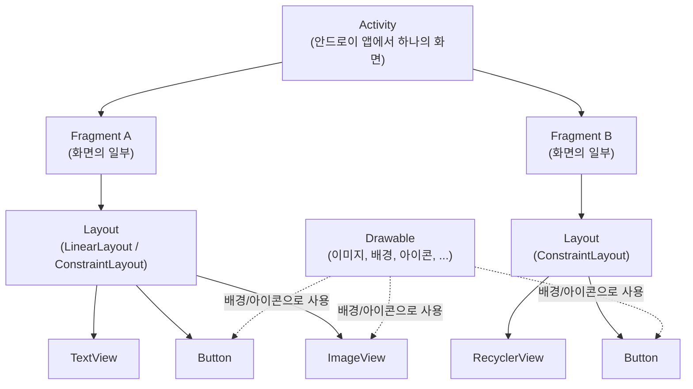

# com.plutozone.knowledge.development.Android

## 안드로이드란?
- 안드로이드의 이해
- 안드로이드의 관계자
	- 단말 제조사
	- 이동 통신사
	- 앱 개발자 그리고 구글

# 개발 도구
- 안드로이드 스튜디오 설치
- 설정(메모리 등)

## Hello, Android
- Hello, Android 시작
	- Project Name, Package Name 등
	- MainActivity.java + main_activity.xml
- AVD로 Hellow, Android 실행
	- Virtual Device and Run
- Hello, Android 변경
	- modify, delete TextView
- 여러 개의 버튼 추가
	- insert a Button
	- insert Buttons

## 단말 연결
- PC에 드라이버 설치
- 단말의 개발자 모드 설정
- PC와 단말 연결(USB vs. Wi-Fi)

## 안드로이드 스튜디오
- 안드로이드 스튜디오 이해
- 뷰
- 레이아웃
- 리소스와 메니패스트
- 그래들(Gradle)

## 레이아웃
- 제약 레이아웃
	- 기본 레이아웃으로 연결선을 제약 조건으로 사용
	- 뷰 영역(콘텐츠 + 패딩 + 테두리 + 마진) vs. CSS 박스 모델
- 리니어 레이아웃
	- 박스 모델(수직 또는 수평 또는 중첩)
- 상대 레이아웃
	- 규칙 모델(부모와의 상대적인 위치, 제약 레이아웃 이후에 미권장)
- 테이블 레이아웃
	- 격자 모델(HTML 테이블과 유사하지만 통상적으로 미사용)
- 프레임 레이아웃과 뷰의 전환
	- 싱글 모델(여러 개의 뷰 또는 뷰 그룹을 중첩하고 최상위만 표시)
- 스크롤뷰
	- 하나의 뷰나 뷰 그룹을 넣어 스크롤 표시

## 위젯과 드로어블의 이해

- 기본 위젯(사용자가 직접 보고 조작하는 UI 요소)
- 드로어블(화면에 그릴 수 있는 이미지 또는 그래픽, 일반적으로 res/drawable 폴더에 저장됨) 생성
- 이벤트 처리의 이해
- 토스트, 스낵바 그리고 대화상자
- 프로그래스바

## 화면 전환
- 레이아웃 인플레이션
- 여러 화면 생성 후 화면 전환
- 인턴트
- 플래그와 부가 데이터 사용
- 태스트 관리
- 액티비티 생명주기와 SharedPreference

## 프래그먼트(Fragment)
- 프래그먼트란?
- 프래그먼트 화면 생성
- 액션바(컨텍스트 메뉴 vs. 옵션 메뉴)
- 상단 탭과 하단 탭 생성
- 뷰페이지(ViewPager) 생성
- 바로가기 메뉴 생성

## 서비스와 수신자
> 안드로이드 앱 = 액티비티 + 서비스 + (브로드케스트) 수신자 + 내용 제공자

- 서비스(백그라운드 vs. 포그라운드)
- 브로드캐스트 수신자
- 위험 권한 부여

## 선택 위젯 생성
선택 위젯(예: 리싸이클뷰)들은 어댑터가 데이터와 뷰를 관리한다.

- 나인 패치 이미지
- 새로운 뷰
- 레이아웃 정의하고 카드뷰 넣기
- 리싸이클뷰
- 스피너

## 애니메이션과 기타 위젯
- 애니메이션
- 페이지 슬라이딩
- 웹뷰(Webview)
- 시크바(SeekBar)
- 키패드 제어

## 스레드와 핸들러
안드로이드 앱은 하나의 프로세스만 허용하므로 서비스 또는 스레드를 이용하여 다중 처리 가능하지만 UI 처리는 핸들러를 통해서만 가능하다.

- 핸들러
- 일정 시간 이후 실행
- 스레드로 애니메이션 생성

## 서버 연동
- 네트워킹이란?	
	- 2 Tier 연결 방식(클라이언트 vs. 서버)
	- 3 Tiier 연결 방식(클라이언트 vs. 응용 서버 vs. 데이터 서버)
	- P2P 연결 방식
- 소켓
	- IP
	- TCP vs. UDP
	- HTTP(비연결형) vs. Socket(연결형 + Thread) 프로그래밍
-  HTTP 요청
	- GET vs. POST
	- Content-type(application/x-www-form-urlencoded vs. multipart/form-data vs. application/json)
- Volley
- JSON 데이터
- 서버 연동

## 데이터베이스와 내용 제공자
- 모바일 데이터베이스
- 데이터베이스와 테이블 생성
- 헬퍼 클래스로 업그레이드 지원
- 데이터 조회
- 내용 제공자(Content Provider)
- 앨범과 연락처 조회

## 그래픽
- 뷰에 그래픽 생성
- 드로어블 객체 생성
- 비트맵 이미지 사용
- 페인트 보드 생성
- 멀티터치 이미지 뷰어 생성
- 머티리얼 디자인

## 멀티미디어
- 카메라로 사진 촬정
- 화면에 카메라 미리보기
- 음악 파일 재생
- 동영상 재생
- 오디오 녹음 저장
- 동영상 녹화 저장
- 유튜브 영상 재생

## 위치기반 서비스
- GPS로 나의 위치 확인
- 현재 위치의 지도 표시
- 지도에 아이콘 추가
- 앱 위젯 생성

## 푸시 서비스와 센서 및 단말 기능
- 진동과 소리 그리고 상단 알림
- Message and Push
	- SMS(SMS/LMS/MMS, 단말 vs. 서버)
	- Push
- 센서(가속, 자이로스코프 등)
- 시스템 서비스(Activity/Package/Alarm Manager)
- 네트워크 기능 활용(Data vs. WiFi)
- 다중 창 지원(여러 Activity)