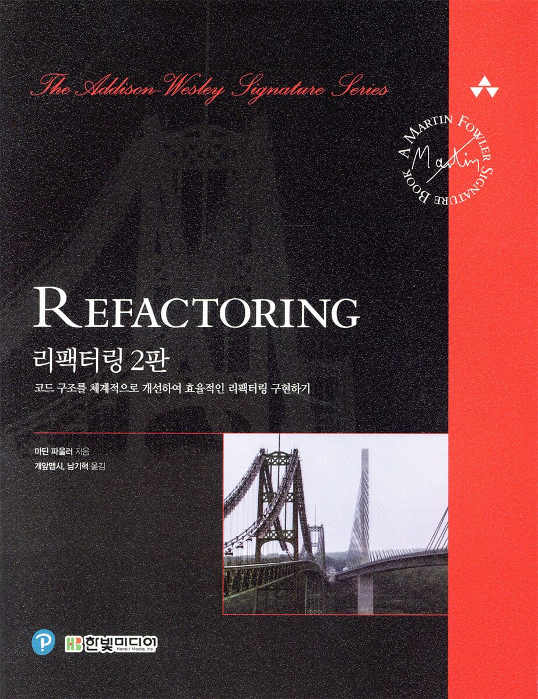

# com.plutozone.knowledge.development.Refactoring

## Overview
### 계획(안)
- 과정 및 과목 분석(x 시간)
	- 강사 소개
	- 과정 및 교과목
		- 과정명: *융합* 머신 비전을 활용한 AI 기반의 첨단 제조 분야 제어 SW 개발 과정-2차(2025-12-22 ~ 2026-07-21)
		- 교과목: `https://docs.google.com/spreadsheets/...`
			- ...
			- **리팩토링과 고도화(120 시간)**
				- 리팩토링 개론과 최적화
				- 객체와 일반화 리팩토링
			- ...
	- 교육생 및 팀 프로젝트를 참고하여 의견 문의
- 리팩토링(60 - x 시간)
	- 리팩토링 개론 그리고 원칙
	- 리팩토링 대상과 검증 환경 
	- 기본적인 리팩토링 카탈로그, 캡슐화와 상속 그리고 API
	- 기능 관리와 데이터 조직화 그리고 로직 간소화
- 고도화(60 - y 시간)
	- 요구 사항, 분석, 설계, 구현, 검증 및 상용화 그리고 자동화(AI 활용 등)
	- 기능적 또는 비기능적(성능, 보안 등) 요구 사항
	- 소프트웨어 개발 및 운영 환경(OS + Network + Service + Build + Deploy or Install/Setup 등)
	- 데이터와 통신 암호화
	- CI/CD
	- Convergence(Web or Mobile or Hybrid)
- 과정 마무리 지원(y 시간)
	- 프로젝트 결과물 및 포트폴리오 개선

### Term and Domain
- Information Technology
	- Bit, Byte, Tab vs. Space, ASCII vs. Binary, ...
- Programming
	- 인라인
	- 프로그램, 프로그래밍, 프로그래머, 프로그래밍 언어, 컴파일, 컴파일러, 인터프리터, 파서, 런타임, 버그, 디버깅
	- 객체 지향, 객체 지향 언어 vs. 절차 지향 언어
	- 클래스, 상속, 수퍼(부모) 클래스, 서브(자식) 클래스
	- 오버라이딩, 오버로딩
	- 멤버 필드/속성, 멤버 함수/메서드

## Contents
1. 리팩토링 개론 그리고 원칙
2. 리팩토링 대상과 검증 환경 
3. 기본적인 리팩토링 카탈로그, 캡슐화와 상속 그리고 API
4. 기능 관리와 데이터 조직화 그리고 로직 간소화

## 1. 리팩토링 개론(예시 포함) 그리고 원칙
### 1-1. 리팩토링이란?
- 리팩토링=구조 개선 vs. 클린 코드-https://github.com/Yooii-Studios/Clean-Code vs. 리모델링과 재건축 at 건축
- 마틴 파울러(Martin Fowler)
	- "컴퓨터가 이해할 수 있는 코드는 누구나 짤 수 있습니다. 사람이 이해할 수 있는 코드를 짜는 게 훌륭한 프로그래머입니다." at Refactoring 2nd Edition
	- 수석 과학자 at ThoughtWorks
	- 제어 역전(Inversion of Control)과 의존성 주입(Dependency Injection) 용어를 대중화

### 1-2. 리팩토링 원칙

## 2. 리팩토링 대상과 검증 환경 구축
### 2-1. 리팩토링 대상

### 2-2. 검증 환경 구축

## 3. 기본적인 리팩토링 카탈로그, 캡슐화와 상속 그리고 API
### 3-1. 기본적인 리팩토링
### 3-2. 갭슐화
### 3-3. 상속
### 3-4. API

## 4. 기능 관리와 데이터 조직화 그리고 로직 간소화
### 4-1. 기능 관리
### 4-2. 데이터 조직화
### 4-3. 로직 간소화

<!--

-->