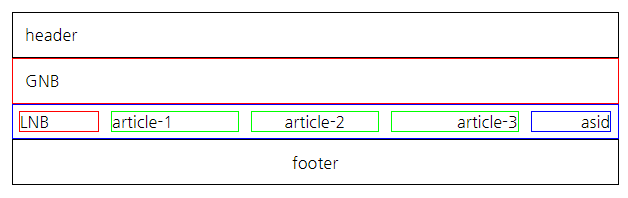
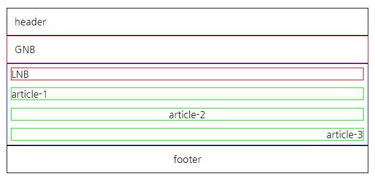

# com.plutozone.knowledge.language.HTML

## Introduction to HTML
- 정적 리소스(Static Resource)
- HTML + CSS + JavaScript는 웹 브라우저(Web Browser)에서 실행
- Web Page at Backend vs. Web Page at Frontend
- Publisher vs. Developer
- My JavaScript Library vs. jQuery(Dynamic UI), AngularJS(Mobile), Vue.js(Dynamic Web Page), …
- [학습 목표] 1) 관리자의 화면 설계서(SB, Story Board) 작성 2) 관리자 화면 구현

## Contents
1. HTML 기반의 웹 화면 설계 및 구현
2. 반응형 웹(Responsive Web) 설계 및 구현
3. 고객 편리성 제공 화면을 위한 설계 및 구현

## 1. HTML 기반의 웹 화면 설계 및 구현
### 1-1. 화면 설계
- UI(User Interface)
	- CLI(Command Line Interface, 명령어 라인 인터페이스)
	- GUI(Graphical User Interface, 그래픽 사용자 인터페이스)
- 요구 사항을 기반으로 화면 설계 표준 정의(로그인, 메인, 페이지 등에 대한 화면 내용, 이동 등 포함)
- 요구 사항을 기반으로 화면 설계서(SB, Story Board) 작성(프로젝트 수행을 위한 간략한 용어 및 기능 포함)
- 필요 시 화면을 구현하기 위해 순서도(Flow Chart) 작성(예: 로그인)

### 1-2. 메뉴 구조
- 요구 사항 및 화면 설계서를 기반으로 메뉴 구조도 작성

### 1-3. 화면 개발(구현) 표준
- 화면 개발 표준
	- W3C(World Wide Web Consortium)
	- KWCAG(Korea Web Content Accessibility Guidelines, 한국형 웹 콘텐츠 접근성 지침)
	- 전자정부 웹 표준
- 웹의 3요소(표준, 접근성, 호환성)

### 1-4. 화면 개발(구현)
- Server(Web Server) vs. Client(Browser) and Web Site vs. Web Page
- Cheat Sheet for HTML, CSS at Google Image(https://www.google.com/imghp?hl=ko&ogbl)
- HTML
	- 개요와 특징
	- 구조
	- [태그(Tag)](/WebContent/html/html.html)
		- a
		- p
		- br
		- img
		- table
		- form
		- input(text, password, radio, checkbox, button, submit, hidden)
		- select
		- textarea 등
	- [시맨틱 태그(Semantic Tag)](/WebContent/html/semantic.html)와 [레이아웃(Layout)](../HTML+CSS/README.md)

- CSS(Cascade Style Sheet)
	- 개요와 특징
	- 선택자(Selector)
		- Tag(<?>)
		- Class(.)
		- ID(#)
	- 속성(Attribute)과 Value(값)
		- font-family
		- font-size
		- color 등
	- 레이아웃(Layout)의 역사(table, position, float, flex)
- JavaScript
	- 문법
	- 이벤트
	- DOM(Document Object Model)

### 1-4. 화면 검증
- Publishing vs. 단위 테스트 또는 통합 테스트

### 1-5. 기타
- HTML의 가독성
- CSS, JavaScript의 가독성과 최적화(min 등) 그리고 보안(난독화 등)

## 2. 반응형 웹(Responsive Web) 설계 및 구현

## 3. 고객 편리성 제공 화면을 위한 설계 및 구현
### 3-1. 메인
### 3-2. 로그인
### 3-3. 목록
### 3-4. 등록 폼 및 등록
### 3-5. 보기
### 3-6. 수정 폼 및 수정
### 3-7. 삭제(처리)