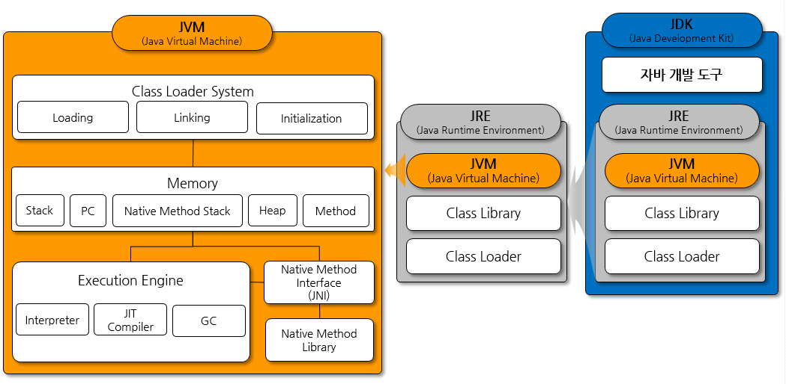
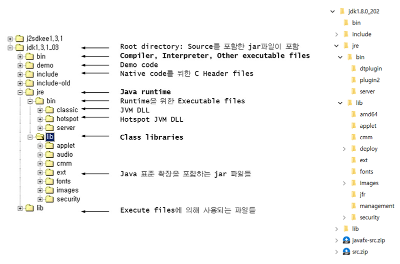
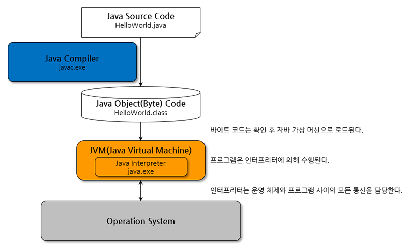
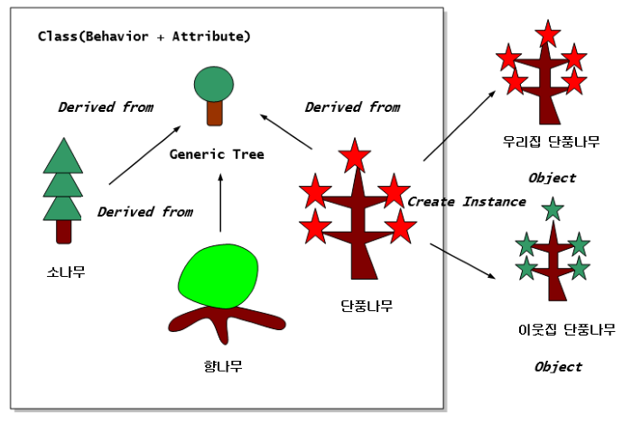
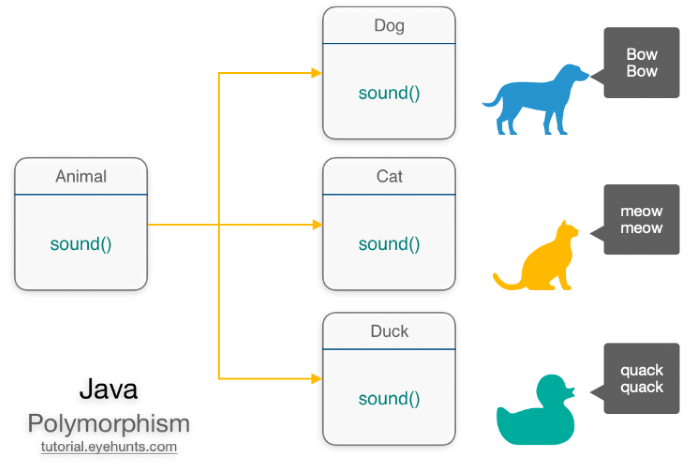
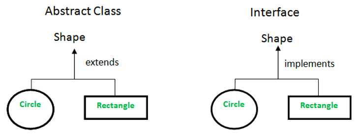
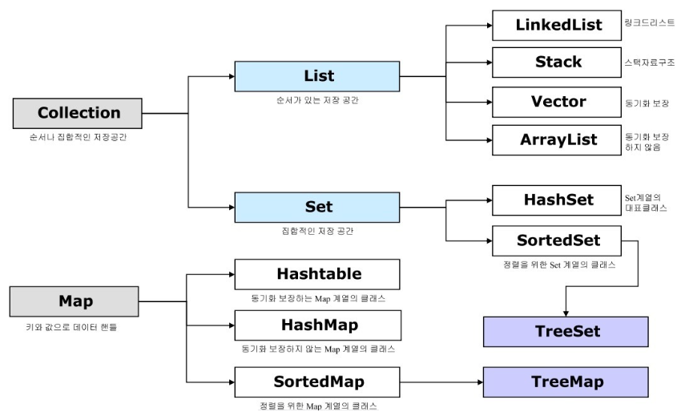
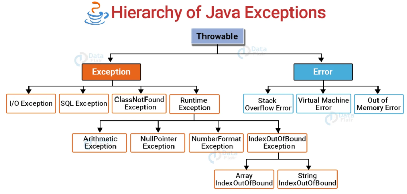

# com.plutozone.knowledge.language.Java


## Overview
- Programming Language vs. Program vs. Programming vs. Programmer
- Programming Language(Java vs. C/C++ 등)의 종류와 특성
- Program(Stand-alone vs. OS 기반 Server/Client vs. Web 기반 Server/Client 등)의 종류와 특성
- Web Program(Static vs. Dynamic)의 종류와 특성
- Eclipse vs. STS(Spring Tool Suite)
- Framework(Struts, Spring 등)
- 개발 툴의 Text, Syntax, Compile 그리고 Runtime 에러를 1) 이해하고 2) 활용하여야 한다.
- **호랑이는 죽어서 가죽을 남기고 사람은 죽어서 이름을 남기고 개발자는 죽어서 코드(네트워크와 서버에)를 남긴다.**
- [학습 목표] 1) 관리자 구현 2) API 구현


## Contents
1. 개발 환경
2. 특징 및 기본 문법 그리고 배열
3. 클래스와 객체
4. 상속과 다형성
5. 추상 클래스와 인터페이스
6. 주요 클래스와 예외 처리
7. 입출력과 스트림
8. 자바 응용 소프트웨어 개발을 위한 설계 및 구현 그리고 고객 편의성


## 1. 개발 환경
### 1-1. 자바(Java) 개발 환경
- Java Standard/Enterprise/Micro Edition 그리고 JDK(Java Development Kit) vs. JRE(Java Runtime Environment)
- Open JDK vs. Oracle JDK and LTS(Long Term Support, 장기 지원 서비스)
- Software Version: Major.Minor.Patch(예: 1.0.0) and 안정화 버전(=Even Number Version)
- JDK 다운로드와 설치
- 환경 설정(JAVA_HOME과 PATH 등)
- System.out.println("Hello, World!");

### 1-2. 이클립스(Eclipse)
- 다운로드와 설치
- Workspace와 Project
- System.out.println("Hello, World!");

### 1-3. Eclipse 설정 및 사용법
- Default Workspace Encoding
- Editor Environment
	- Line Number
	- White Space
	- Spelling(dictionary)
- 자동 완성(Ctrl + Space)
- [Code Template & Configuration](../development/eclipse.md)
- [Plug-in](../development/eclipse.md)

### 1-4. To be continue


## 2. 특징 및 기본 문법
### 2-1. About Java
- Java history
	- Copyright 1990s © Sun Microsystems, James Gosling
	- Base language는 UCSD Pascal, C++
	- Netscape Navigator 2.0 + Java Applet on Internet
- Java Program
	- Java Applet(Web Browser에서 실행되며 Windows의 ActiveX와 유사)
	- Java Application-AWT/Swing(Console 또는 Window 형태로 Local에서 실행되며 Windows의 EXE와 유사)
	- Java Servlet(Applet과 달리 Server에서 실행되며 Post나 Get 방식으로 사용자의 입력 처리가 가능)
	- JSP(Java Server Page, Server 기반으로 동적 Web Page를 생성하며 Windows의 ASP와 유사)
	- Java Beans(Java에서 재사용이 가능한 Software Object를 만드는 기술의 결과로 만들어진 Component로서 각종 다양한 목적을 위한 소형 Module로 Windows의 DLL과 유사)
	- EJB(Enterprise Java Beans, EJB는 확장성 있는 Application Server Component들을 지원하는 여러 Service들을 제공함으로써 Business Application들을 Component 단위로 쉽게 작성할 수 지원하며 Windows의 .NET과 유사)
- Java Characteristic
	- Scalability(From enterprise system to small device)
	- Light and easy code + Real OOP(But OOP is not easy)
	- Independent platform(Byte code at JVM: Write once, run everywhere)
	- Source Charset support UTF-16 vs. UTF-8 vs. ANSI


- Java vs. C++ and procedure, structured programming
	- Remove pointer, structure, union
	- All code in class
- Java Folder


- Class library Source: C:\jdk*\src.jar vs. C:\Program Files\Java\jdk*\src.zip

### 2-2. Compile and Run
- For Beginner: 99%(Text + Syntax + Compile)
	- Edit & Save > Compile > Run
	- [ERROR] Text(Case Sensitive 등)
	- [ERROR] Syntax or Compile
	- [ERROR] Runtime
- Compile
	- C:\Example\javac HelloWorld.java


- Run
	- C:\Example\java HelloWorld
	- C:\Example\appletviewer ExApplet.html
- Error vs. Warning

### 2-3. 주석과 문장 그리고 변수와 상수 및 자료형
- 주석
	- //
	- /* … */
	- /** … * /
	- 주석 for Java Doc
- 문장(sentence or statement, ;)
- 변수 선언(예약어 등 제약 사항, 카멜 표기법)과 상수(final), 자료형(정수, 실수, 문자, 문자열, 논리형 등) 그리고 초기화(initialize) 또는 대입(assign)
- 자동(묵시적) 형 변환 vs. 강제(명시적) 형 변환, 산술 연산 시 자동 형 변환(피연산자들이 리터럴 또는 long이 아닌 경우 변수의 형은 int로 자동 변환됨) 그리고 문자열을 자료형으로 강제 타입 변환(parse)

### 2-4. 연산자와 우선 순위
- 단항, 이항, 삼항
- 대입, 부호, 산술, 증가, 감소, 관계(비교), 논리, 복합 대입, 조건, 비트, 시프트

### 2-5. 제어문
#### 2-5-1. 조건문(Conditional Statements)
- if
- if/else
- if/else if
- if/else if/else
- switch/case

#### 2-5-2. 반복문(Loop Statements)
- while
- do/while
- for
- for each(`com.plutozone.syntax.control.ForEach`)
- break와 continue

### 2-6. 기본 타입(Primitive Type) vs. 참조 타입(Reference Type)
- 기본 타입(형) 변수에는 정수, 실수, 문자, 논리에 대한 실제 값(=리터럴)를 저장
- 참조 타입(형) 변수에는 배열, 열거, 클래스, 인터페이스와 같이 객체를 참조하는 주소(Address)를 저장
- `com.plutozone.syntax.type.Reference`

### 2-7. 배열(Array)
- 배열의 선언(객체 포함)과 초기화 그리고 Index
- 배열의 크기와 사용
- 배열의 복사(System.arraycopy()) 그리고 배열의 주소 복사(shallow copy) vs. 값 복사(deep copy)
- 다차원 배열
- ArrayList 클래스(선언 시 크기 지정 없음)

### 2-8. 열거 타입(Enumeration Type)
- 한정된 상수를 갖는 타입(예: 요일, 계절, 전문 번호 등)


## 3. 클래스와 객체 그리고 배열
### 3-1. 객체 지향 프로그래밍(OOP, Object Oriented Programming)과 클래스(Class)
- 객체(Object) =  속성(Property or Attribute) + 메서드(Method)<sup>단독이 아닌 객체에 속한 함수라는 의미에서 메서드란 이름 부여(속성도 동일함)</sup>
- 클래스(Class) = 멤버 변수(Membership Field) + 멤버 함수(Member Function)
- 패키지(Package)
- 절차 지향 프로그래밍 vs. 객체 지향 프로그래밍(OOP, Object Oriented Programming)
- 패키지(Package)와 클래스(Class) 선언과 멤버 변수(Membership Field)와 멤버 함수(Member Function) 정의



### 3-2. 메서드(Method) 또는 함수(Function)
- 반환형 이름(매개변수) { …; return 반환값; }
- Overloading vs. Overriding

### 3-3. 클래스(Class)와 인스턴스(Instance)
- 클래스형 변수명 = new 생성자;
- 클래스 정보(`com.plutozone.syntax.classes.Clazz`)

```java
Class clazz_1 = 클래스.class;
Class clazz_2 = Class.forName("패키지.클래스");
Class clazz_3 = 참조변수.getClass();

System.out.println(clazz_1.getName());
System.out.println(clazz_2.getName());
System.out.println(clazz_3.getName());
```

### 3-4. 생성자(Constructor)
- 디폴트 생성자와 매개 변수 생성자

### 3-5. 접근 제어자(Access Modifier)
- public, protected, private, DEFALUT(같은 패키지 내부에서만 접근 가능)

### 3-6. 기타
- this
- static 변수(=클래스 변수)와 메서드(=클래스 메서드)
- 변수의 유효 범위: 지역(Local) 변수, 멤버(Instance) 변수, 클래스(Static) 변수

- this
- static 변수(=클래스 필드)와 메서드(=클래스 메서드)
- 변수의 유효 범위: 지역(Local) 변수, 멤버(Instance) 변수, 클래스(Static) 변수
- Singleton(한 개의 객체만 생성할 수 있으며 메모리 낭비 방지 등을 위해 사용)
- final과 Constant(static final)


## 4. 상속과 다형성
### 4-1. 상속(Inheritance)<sup>Java is not support Multiple-Inheritance</sup>
- 상위(Parent, 부모) 클래스와 하위(Child, 자식) 클래스 그리고 상속(extends)
- 하위 클래스의 생성 프로세스와 super 그리고 형 변환
- 메서드 재정의(Method Overriding, @Override)와 final
- 필드 또는 매개변수의 자동/강제 형 변환(Casting)에 따른 가상 메서드

### 4-2. 다형성(Polymorphism)
- 하나의 코드가 여러 자료형으로 구현되어 실행(예: 필드 또는 매개변수의 자동/강제 형 변환에 따른 가상 메서드, 추상 클래스, 인터페이스 등)
- Down Casting과 instanceof




## 5. 추상 클래스와 인터페이스

### 5-1. 추상(Abstract) 클래스<sup>동일한 객체 변수로 해당 메서드를 상속한 클래스의 메서드 호출(하나의 코드가 여러 자료형으로 구현되어 실행)</sup>
- 추상 클래스는 구현되지 않은 메서드가 있고 상속(extends) 클래스에서 구현해야 사용 가능
- final을 통한 템플릿 메서드 정의
- final: 변수(상수), 메서드(템플릿) 및 클래스(마지막-보안 등)

### 5-2. 인터페이스(Interface)<sup>동일한 객체 변수로 해당 메서드를 구현한 클래스의 메서드 호출(하나의 코드가 여러 자료형으로 구현되어 실행) + 다중 구현</sup>
- 인터페이스는 모든 메서드가 추상 메서드이며 클래스에서 구현(implements)
- 인터페이스에 디폴트(default, 재정의 가능)와 정적(static) 메서드 정의 at Java 8 over
- 인터페이스에 전용(private) 메서드 정의 at Java 9 over
- 다중 구현, 디폴트 메서드 중복 시, 인터페이스 상속, 인터페이스 구현과 상속 동시 적용 및 실무에서 사용 방안


## 6. 주요 클래스와 예외 처리
### 6-1. 오브젝트(Object) 클래스
- 모든 클래스의 최상위는 Object 클래스
- 주요 메서드: String toString(), boolean equals(Object object) 등
- String과 Integer의 toString() vs. toString() 재정의
- String과 Integer의 equals()<sup>=value</sup> vs. 그 외의 equals()<sup>=Address</sup> 그리고 필요 시 재정의

### 6-2. 문자열(String) 클래스
- String 클래스 vs. StringBuffer와 StringBuilder 클래스

### 6-3. 레퍼(Wrapper) 클래스
- Boolean, Byte, Character, Short, Integer 등

### 6-4. 컬렉션(Collection) Framework<sup>단일 vs. 멀티 쓰레드(잠금과 해제) 그리고 속도</sup>
- Generic Programming: 런타임(Runtime) 시 자료형 확정
- 제네릭(Generic) 클래스 정의와 사용
- 자바에서 제공하는 자료 구조 라이브러리를 컬렉션 프레임워크는 대부분 제네릭(Generic)을 사용



### 6-5. 내부(Inner) 클래스와 유형
- 내부 클래스가 외부 클래스와 밀접한 관계에 있고 다른 클래스와 관계가 없을 때
- 인스턴스 내부 클래스, 정적 내부 클래스, 지역 내부 클래스 그리고 익명(`com.plutozone.syntax.anonymous.*`) 내부 클래스

### 6-6. 중첩(Nested) 클래스
- `com.plutozone.syntax.classes.UsingNested`

### 6-7. 람다식(Lambda expression, 함수형 프로그래밍) at Java 8 over
- 람다식 문법과 사용

### 6-8. 스트림(Stream)<sup>자료에 대한 Sorting, Filter 기능 등을 제공</sup>
- 스트림 종류(중간 연산, 최종 연산)와 사용 그리고 특징

### 6-9. 예외(Exception) 처리와 예외 클래스
- 컴파일 시 에러(Compile Error) = 문법 에러(Syntax Error) vs. 실행 시 에러(Runtime Error) = Bug(버그) 그리고 Debug(디버그)
- 시스템 에러(Error) = 제어 불가?(예: Static Memory Overflow) vs. 예외(Exception) = 제어 가능(예: File Not Found)
- try catch finally vs. try With Resource Statements
- throw와 다중 예외 처리와 순서
- 사용자 정의 예외
- 로그 레벨(log4j: ALL > TRACE > DEBUG > INFO > WARN > ERROR > FATAL > OFF)과 로깅의 중요성 그리고 보안




## 7. 입출력과 스트림
### 7-1. 입출력(Input and Output)과 스트림(Stream) 클래스
- 스트림(Stream) 클래스: 자바 프로그램과 입출력 장치(예: 키보드, 디스크 등) 사이에서 효율적인 입출력을 위해 제공되는 클래스
- 입력(*Input*, *Reader) vs. 출력(*Output*, *Writer) 스트림
- 바이트(*Stream) vs. 문자(*Reader, *Writer) 단위 스트림

### 7-2. 표준 입출력 등
- System.in, System.out, System.error
- 그 외 입력 클래스: Scanner, Console

### 7-3. 바이트 단위 스트림<sup>주로 바이너리 파일에 이용</sup>
- InputSteam, FileInputStream
- OutputStream, FileOutputStream

### 7-4. 문자 단위 스트림<sup>주로 텍스트 파일에 이용</sup>
- Reader, FileReader
- Writer, FileWriter

### 7-5. 보조 스트림
- *Stream*, Buffered*<sup>속도 개선</sup>, Data*

### 7-6. 직렬화(Serializable)와 역직렬화<sup>인스턴스를 저장 또는 전송을 위해 스트림화</sup>
- Serializable 인터페이스
- transient와 serialVersionUID 그리고 Externalizable

### 7-7. 기타 입출력 클래스
- File, RandomAccessFile


## 8. 자바 응용 소프트웨어 개발을 위한 설계 및 구현 그리고 고객 편의성