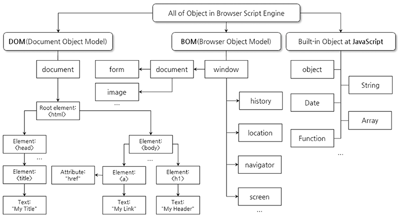

# com.plutozone.knowledge.language.JavaScript


## Contents
1. JavaScript 특징과 기본 문법들
2. 제어문
3. 객체(Object)
4. 함수(Function)
5. 객체(HTML Element) 선택과 관리 및 이벤트 처리
6. Ajax(Asychronous JavaScript and XML)
7. jQuery


## JavaScript 특징과 기본 문법들
### 에러 시 at Chrome

### 개요
- Frontend vs. Backend
- HTML, CSS, and JavaScript are downloaded from the Server and run in the Browser.
- 탄생과 표준화 그리고 확장(jQuery, AngularJS, ReactJS, Vue.js, Node.js, PhoneGap 등)

### 개발 환경
- Browser(IE, Edge, Chrome 등) + Editor(Notepad, EditPlus, SublimeText, Brackets, Visual Studio Code, Eclipse 등)

### 기본 문법
- 문장(;)과 대소문자 구분 등
- 선언문

```
...
<head>
	<script> … </script>
</head>
<body>
	<script> … </script>
</body>
...
```

- 주석
	- //
	- /* …*/
- 전역 또는 지역 변수
	- var
	- 예약어
- 자료형
	- String(")
	- Char(')
	- Number
	- Boolean(true, false)
	- Undefined
- 연산자
	- 산술
	- 대입
	- 증감
	- 비교
	- 논리
	- 삼항
	- 연산자 우선 순위
- 템플릿 리터럴
	- JavaScript에서 backtick(`) 문자를 사용하여 문자열을 표현
```js
		var name		= "James";
		var message	= `Dear ${name} 
My name is Pluto.
			I'm ${1+1} years old.`;
		alert(message);
```

이렇게 사용하면, 두가지 기능이 있는데 (1)줄바꿈을 쉽게 할수 있고, (2)문자열 내부에 표현식을 포함할 수 있게 된다.

## 제어문
### 조건문(Conditional Statements)
	- if
	- if/else
	- if/else if
	- if/else if/else
	- switch/case

### 반복문(Loop Statements)
	- while
	- do/while
	- for
	- break와 continue


## 객체(Object)
- 객체(Object) = 메소드(Method) + 속성(Property) + 이벤트(Event)
- 객체(All of Object in Browser Script Engine) in JavaScript
	- 내장 객체(Built-in Object): Object, String, Date, Array, Math, RegExp 등
	- 브라우저 객체 모델(BOM, Browser Object Model): window, screen, location, history, navigator 등
	- 문서 객체 모델(DOM, Document Object Model): HTML 문서 구조



## 함수(Function)
- 정의

```
...
function functionName() {…}
...
```

- 매개 변수
- 리턴(return)과 값
- 내장 함수(Built-in Function)
	- encode*()
	- parse*()
	- eval() 등


## 객체(HTML Element) 선택과 관리 및 이벤트 처리
### 선택자(Selector)
### 관리 메서드(Method)
### 이벤트(Event) 등록과 처리 그리고 제거


## Ajax(Asychronous JavaScript and XML)
- 비동식 방식의 JavaScript와 XML
- HyperText(화면 전환 필요) vs. Ajax 그리고 동기식(응답 대기 필요) vs. 비동기식
- Text vs. HTML vs. XML vs. JSON


## Example
- [JavaScript](/WebContent/knowledge/language/js/default.html)
- [Mojs-1](/WebContent/knowledge/language/js/mojs-1.html)
- [Mojs-2](/WebContent/knowledge/language/js/mojs-2.html)


## jQuery
### jQuery란?
- JavaScript의 대표적인 Library
- 브라우저 호환성(DOM과 Event Object가 브라우저에 따라 상이함) 문제 해결?
- 애니메이션 기능 등 지원
- 사용 방식 그리고 버전, 압축 여부 등
	- Download 방식(https://jquery.com/download/)
	- CDN 방식(https://cdnjs.com/libraries/jquery)