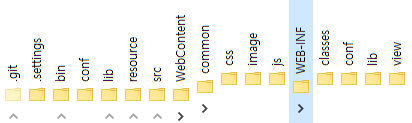
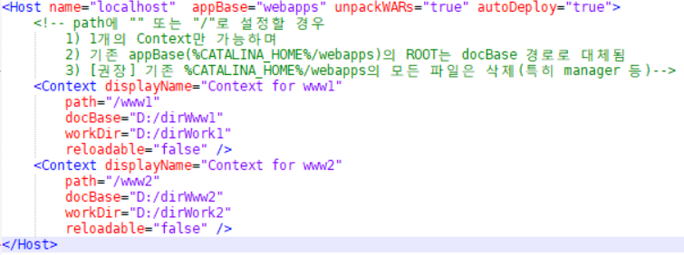
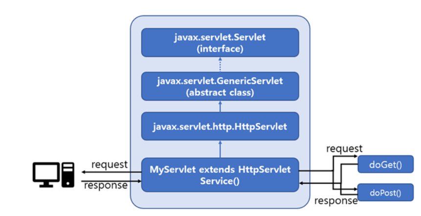
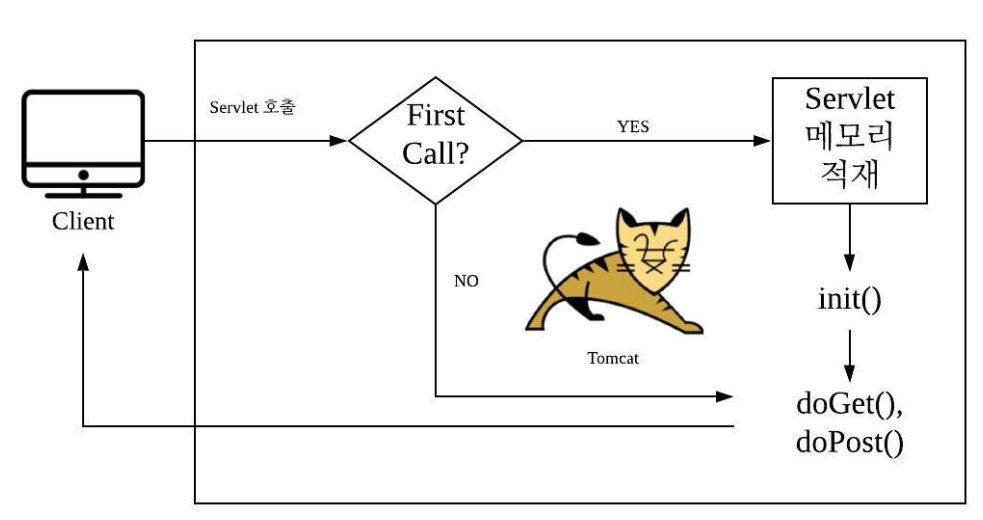

# com.plutozone.knowledge.language.JSP

01. [개발 환경](#1-개발-환경)
02. [웹 프로그래밍과 Servlet](#2-웹-프로그래밍과-servlet)
03. [JSP 개념과 동작 원리 그리고 내장 객체](#3-jsp-개념과-동작-원리-그리고-내장-객체)
04. [Action Tag와 EL(Expression Language, 표현 언어) 그리고 JSTL 등](#4-action-tag와-elexpression-language-표현-언어-그리고-jstl-등)
05. [MVC 디자인 패턴](#5-mvc-디자인-패턴)

## 1. 개발 환경
### JDK
- 다운로드 및 설치 그리고 환경 설정(JAVA_HOME과 PATH 등)

### Tomcat
- 다운로드 및 복사 또는 설치 그리고 필요 시 환경 설정(CATALINA_HOME 등)

### Eclipse or Visual Studio Code
- Eclipse 다운로드 및 복사 또는 설치 그리고 Workspace 및 Project 설정
- 필요 시 Visual Studio Code 다운로드 및 설치

### Oracle or MySQL or MariaDB
- Oracle Database 11g Express Edition(필요 시 MySQL, MariaDB 포함) 다운로드 및 설치 그리고 데이터베이스, 계정 등 생성
- 필요 시 서비스 시작 유형 변경

### SQL Developer or MySQL Workbench or HeidiSQL
- SQL Developer(필요 시 MySQL Workbench, HeidiSQL 포함) 다운로드 및 압축 해제 후 실행 또는 설치 그리고 접속
- exERD or https://draw.io

## 2. 웹 프로그래밍과 Servlet
### Web Application
- Web(HTML + CSS + JavaScript) vs. Web(HTML + CSS + JavaScript) Application(JSP 등)
- 일반적인 폴더 구조
	

### 기존 Web Application 등록 at Tomcat Container(server.xml)
- Context(별도의 web.xml 등) vs. Folder(ROOT에 종속)
	

### 신규 Web Application 개발 및 배포 by Eclipse
- 새로운 웹 프로젝트(Dynamic Web Project) 생성 후 HTML, JSP 등 개발 at Eclipse IDE for Java EE Developers(vs. Eclipse IDE for Java Developers)
- 새로운 톰캣 서버(Tomcat Server) 생성 및 새롭게 생성된 프로젝트와 연동
- 새롭게 생성된 톰캣 서버를 실행하고 웹 브라우저를 통해 신규 Web Application(예: http://localhost/newApplication/html.jsp) 확인
- 새롭게 생성된 프로젝트를 WAS의 appBase에 WAR 파일로 Export하면 압축이 자동 해제되며 새로운 Web Application로 실행(참고적으로 새롭게 생성된 프로젝트는 별도의 web.xml 등을 포함하고 있어 톰캣의 server.xml에 등록하지 않아도 새로운 Web Application으로 인식하여 동작한다.)

### 서블릿(Servlet)
- Java에서 최초의 동적 웹 페이지를 제공하는 클래스이며 Tomcat과 같은 JSP/Servlet Container에서만 실행 가능
- Servlet의 계층 구조와 기능 그리고 생명 주기
	
- Servlet 개발(import servlet-api.jar 포함)과 1) Full URL vs. 2) 매핑 at web.xml vs. 3) Annotation을 사용한 매핑
- Servlet 동작 방식	
	

### Servlet 기본
- Request(javax.servlet.http.HttpServletRequest): Get 또는 Post 방식, 파라미터와 값
- Business(DB 연동 등) Logic
- Response(javax.servlet.http.HttpServletResponse): MIME-TYPE

### Servlet의 DB 연동
- DB 생성
- Driver를 통한 연동과 Statement vs. PrepareStatement
- DataSource를 통한 연동

### Servlet의 확장과 Cookie와 Session 그리고 Servlet Filter와 Listener
- Forward(redirect, refresh, location vs. dispatch)
- Binding
- ServletContext vs. ServletConfig
- load-on-startup
- Cookies vs. Session
- Servlet Filter와 Listener

## 3. JSP 개념과 동작 원리 그리고 내장 객체
### JSP(Java Server Page)의 등장 배경과 역할 그리고 구성 요소
- Servlet의 문제점(HTML + CSS + JavaScript로 이루어진 화면과 로직이 혼재)
- MVC(Model View Controller)에서 View를 담당
- 구성 요소
HTML + CSS + JavaScript
JSP Tag(Script Tag + Directive Tag + Action Tag + Custom Tag)
Custom Tag

### JSP 동작 원리
- 클라이언트가 요청한 JSP를 Servlet으로 변환(*.java) at Container
- 변환된 Servlet을 컴파일(*.class) at Container
- Servlet를 실행하여 HTML + CSS + JavaScript를 클라이언트에게 전송 at Container

### 지시 태그(Directive Tag)
- 페이지 지시 태그(Page Directive Tag)
- 인클루드 지시 태그(Include Directive Tag)
- 태그 라이브러리 지시 태그(Taglib Directive Tag)

### 스크립트 태그(Script Tag)와 주석
- 선언문(Declaration): (전역) 변수나 메서드 선언 시(<%! ... %>)
- 스크립트릿(Scriptlet): 코드 시(<% ... %>)
- 표현식(Expression): 출력 시(<%=...%>)
- 주석 at JSP
	- HTML 주석(<!-- … -->)
	- JSP 주석(<%-- … %>)
	- Java 주석 (/* … */)

### JSP 내장 객체(=Servlet 객체)
- session, application
- request, out
- exception과 errorPage vs. web.xml에서 Error와 Welcome 페이지 설정
- response, pageContext, page, config 등

### JSP + DataSource
- ...

## 4. Action Tag와 EL(Expression Language, 표현 언어) 그리고 JSTL 등
### 액션 태크(Action Tag): 정적 Java 코드가 아닌 동적 그리고 표현 중심의 태그(<jsp: />)]
- <jsp:include>
- <jsp:forword>
- <jsp:useBean> 그리고 <jsp:setProperty>와 <jsp:getProperty>

### 표현 언어(EL, Expression Language): 다양한 표현식을 제공(${ … })
- 표현 언어의 사용 그리고 자료형과 연산자
- 표현 언어의 내장 객체

### JSTL(JSP Standard Tag Library) 그리고 커스텀 태그(Custom Tag): 자주 사용하는 기능을 태그로 제공 그리고 사용자 정의 태그(<c: /> 등)
- JSTL 태그 종류: 코어(c), 국제화(fmt), 함수(fn) 등

### 기타
- 파일 업로드 및 다운로드
- HTML5와 jQuery for Web Page

## 5. MVC 디자인 패턴
### 웹 어플리케이션 모델
- 모델 1(화면 + 로직 at JSP) vs. 모델 2(화면과 로직이 별도, 예: MVC)
- MVC by DAO/DTO(Model) + JSP(View) + Servlet(Controller)
- MVC by Service(for transaction)/DAO/DTO(Mode) + JSP(View) + Servlet(Controller)
