# com.plutozone.knowledge.language.Spring

01. Spring Framework와 MVC
02. Spring AOP
03. JDBC vs. MyBatis
04. Annotation과 Transaction
05. Supports at Spring
06. REST API와 Spring Boot
07. Tip
08. 게시판과 쇼핑몰

## 1. Spring Framework와 MVC
### Framework
- 어떤 것을 구성하는 구조 또는 뼈대(소프트웨어에서는 기능을 미리 클래스나 인터페이스 등으로 제작하여 제공하는 형태)
- Spring은 Java Web Application 개발을 위한 Open Source Framework

### Spring Framework의 특징(MVC  포함)
> IoC는 "누가 객체와 실행 흐름을 관리하느냐"에 대한 개념이고 DI는 "그 제어를 실현하기 위해 객체를 주입하는 구체적인 방법"

- EJB보다 가벼운 경량 컨테이너(Light Weight Container)
- 제어 역행(IoC, Inversion of Control)자동 서블릿 또는 빈 생성 by Framework 기술을 이용해 Application들의 약한 결합(Loosely Coupled)
- 의존성 주입(DI, Dependency Injection)자동 객체 생성 by Framework 기능을 지원
- 관점 지향 프로그래밍(AOP, Aspect Oriented Programming)공통 기능의 모듈화 기능을 이용해 자원 관리
- 영속성과 관련된 다양한 서비스 및 다수의 라이브러리와 연동 지원
	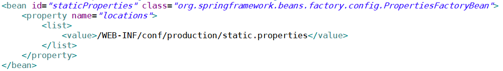

### Spring Framework 환경 설정
- Maven vs. Spring Framework Library

### 의존성 주입(DI, Dependency Injection
- @Inject(=new) at Javax(Servlet) or `@Autowired(=setter) at Spring`
	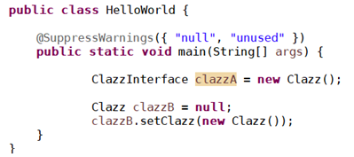

### 관점 지향 프로그래밍(AOP, Aspect Oriented Programming)
- @Aspect, @Pointcut, @Around

## 2. Spring AOP
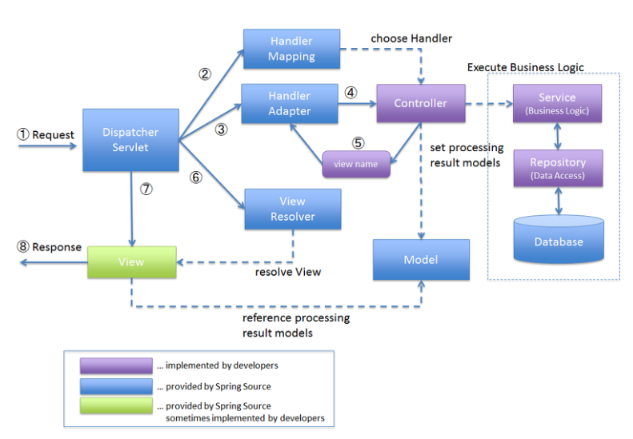

## 3. JDBC vs. MyBatis
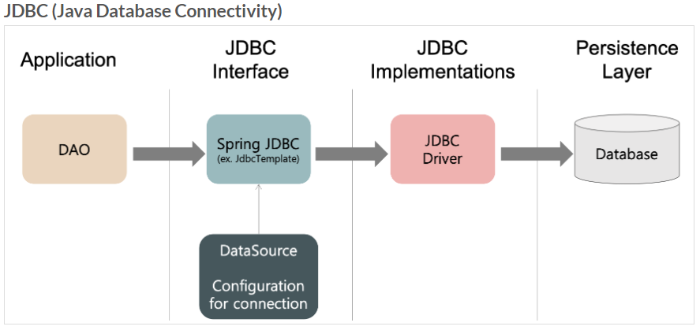
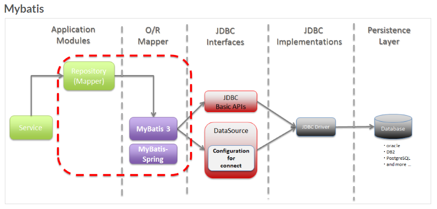

## 4. Annotation과 Transaction
### Annotation
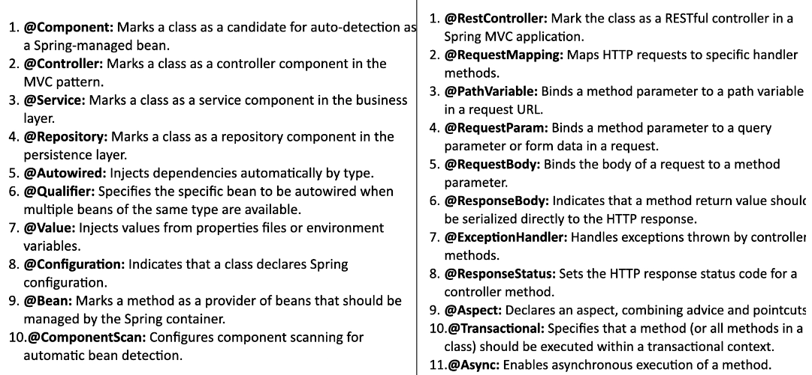
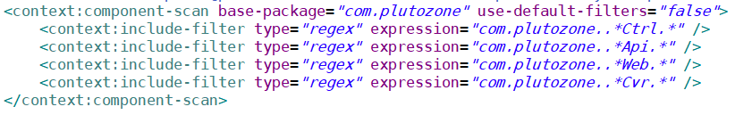
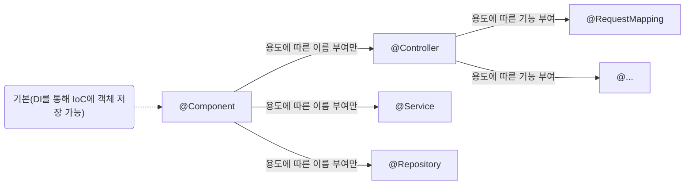

### Transaction
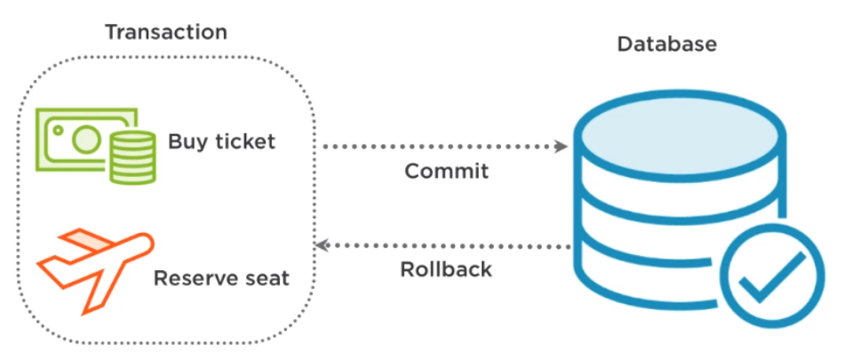
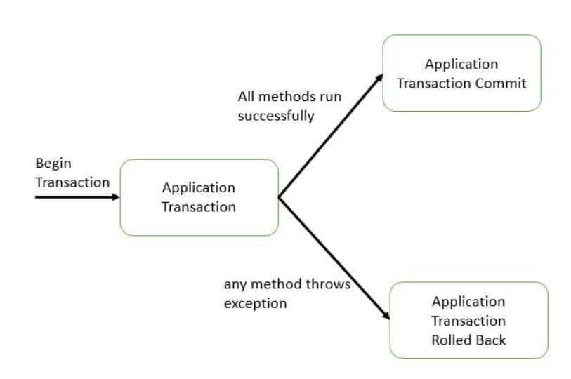
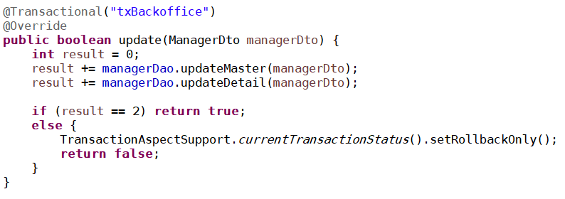

## 5. Supports at Spring
### File Upload

### Thumbnail Image vs. Image CSS

### Email

### Interceptor
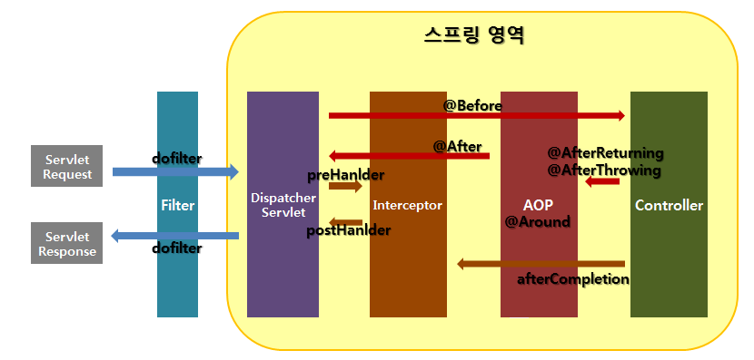

## 6. REST API와 Spring Boot
### REST
- Web Page vs. REST(Representational State Transfer)자원을 자원(resource)의 표현(representation) 으로 구분하여 해당 자원의 상태(정보)를 주고 받는 모든 것을 의미

### [Spring Boot](https://github.com/myPlutoZone/com.plutozone.demo.springBoot)

## 7. Tip
### 라이브러리(오픈 소스 포함)의 올바른 사용
- 실제로 사용하는 라이브러리만
- 문제점(log4j 등) 확인
- JRE/JDK vs. WAS vs. Application

## [8. 게시판과 쇼핑몰](https://github.com/myPlutoZone/com.plutozone.openMalls)